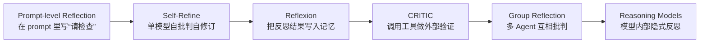

# 1. 背景

> 一句话理解：**Reflection 的出现，是因为单轮 LLM 和 ReAct 都会犯错，而 Agent 需要像人类一样“停下来想一想，哪里不对，怎么改”**。

## 1. 单轮 LLM 的局限：快但容易错

单轮 LLM 已经能完成很多任务，但在复杂、多约束、需要长程一致性的场景下，它的问题显而易见：

- **幻觉**：生成看似合理但错误的事实、代码或数据。
- **局部最优**：只根据当前 prompt 做“一次性”回答，无法回头修正。
- **忽略约束**：面对长 prompt 中的某条细则，模型可能遗漏或理解偏差。
- **无法自检**：模型不会主动说“我刚才可能错了”，除非 prompt 明确要求。

这些局限在代码生成、数学推理、法律文书、医学问答、复杂规划等场景尤为致命。

## 2. ReAct 也会犯错：行动不等于反思

ReAct（Reasoning + Acting）通过“思考 → 行动 → 观察”循环，让 Agent 可以调用工具、获取外部信息。但它仍然存在明显盲区：

| 问题 | 说明 |
|---|---|
| **错误传播** | 早期一步推理错误，后续行动会沿着错误方向继续。 |
| **工具误用** | 选错工具、填错参数、误读返回结果，ReAct 往往不会主动回溯。 |
| **过早终止** | 一旦得到“看起来合理”的答案，Agent 就停止，不会回头验证。 |
| **无质量评估** | ReAct 循环里没有显式的“质量打分”环节，无法量化当前答案有多好。 |

ReAct 让 Agent “能动起来”，但没有让 Agent “能审视自己的动作”。Reflection 填补的正是这一环。

## 3. 人类元认知的启发

人类的专家在解决复杂问题时，往往不是一次到位，而是经历一个“草稿—检查—修改”的过程：

```text
生成初稿 → 发现漏洞 → 评估严重程度 → 定向修改 → 再次检查
```

这就是**元认知（metacognition）**：对自己的思考过程进行思考。Agent Reflection 正是把这套机制工程化：

| 人类行为 | Agent Reflection 对应 |
|---|---|
| 写完后通读一遍 | Critic 生成批判意见 |
| 判断错误是否严重 | Evaluator 打分或分类 |
| 根据反馈修改 | Revision Controller 驱动 Generator 修订 |
| 改完再检查 | 下一轮 Reflection Loop |
| 不确定时请教他人 | Human-in-the-Loop / 外部验证工具 |

## 4. Reflection 的演进阶段

Reflection 从简单到复杂，大致经历了以下几个阶段：



| 阶段 | 核心特征 | 代表 |
|---|---|---|
| **Prompt 级反思** | 通过 system prompt 或 few-shot 要求模型检查 | 手写 prompt |
| **Self-Refine** | 同一个模型轮流担任生成者和批判者 | Self-Refine |
| **记忆化反思** | 把反思结论写入长期记忆，影响未来任务 | Reflexion |
| **工具化反思** | 调用编译器、搜索引擎、数据库等外部工具验证 | CRITIC |
| **群体反思** | 多个 Agent 互相审阅、投票、合并意见 | AutoGen Reflect、Multi-Agent 审稿 |
| **内隐反思** | 模型在内部进行长链推理与自我修正 | OpenAI o1 / o3 |

## 5. 典型应用场景

Reflection 在以下场景中价值最大：

### 代码生成

- 生成代码后，用静态分析、编译器、单元测试做外部验证。
- Critic 检查是否遗漏异常处理、边界条件、类型安全。

### 内容创作

- 写作完成后，检查事实准确性、结构清晰度、风格一致性。
- Evaluator 按“可读性、信息量、语法”打分，Generator 定向润色。

### 规划与决策

- 生成计划后，Critic 检查是否违反约束、资源是否超限、依赖是否闭环。
- Plan Reflection 在抽象层面修正，而非等到执行失败才重试。

### 工具使用

- 调用外部 API 后，Critic 检查返回结果是否与预期一致。
- 参数错误、权限错误、返回格式异常时，Revision Controller 驱动重试或换工具。

### 数学与逻辑推理

- 每一步推理后验证中间结论。
- Tree of Thoughts 结合 Reflection 在搜索空间中剪枝。

## 6. 为什么 Reflection 不是“多采样一次”

有人可能认为：让模型多生成几次选最好的，不就等于反思了吗？其实不然：

| 多采样 | Reflection |
|---|---|
| 并行生成多个答案 | 串行生成—批判—修订 |
| 依赖外部选择器挑最好的 | 内部有明确的打分与修订逻辑 |
| 不解释为什么更好 | Critic 输出具体修改理由 |
| 不积累经验 | 反思结果可写入 Memory |
| 没有外部验证 | 可调用工具获取客观反馈 |

Reflection 的核心价值在于**可解释、可量化、可迭代、可沉淀**。

## 本章小结

Reflection 的背景可以追溯到单轮 LLM 的幻觉与 ReAct 的错误传播问题。人类元认知提供了“生成—批判—评估—修订”的直觉框架。工程上，Reflection 从 prompt 级反思逐步演进到 Self-Refine、Reflexion、CRITIC、群体反思，直至 reasoning models 的内隐反思。它在代码、写作、规划、工具使用、数学推理等需要高正确率的场景中尤为关键。

**参考来源**

- [Self-Refine: Iterative Refinement with Self-Feedback](https://arxiv.org/abs/2303.17651)
- [Reflexion: Self-Reflective Agents with Verbal Reinforcement Learning](https://arxiv.org/abs/2303.11366)
- [CRITIC: Large Language Models Can Self-Correct with Tool-Interactive Critiquing](https://arxiv.org/abs/2305.11738)
- [Tree of Thoughts: Deliberate Problem Solving with Large Language Models](https://arxiv.org/abs/2305.10601)
- [ReAct: Synergizing Reasoning and Acting in Language Models](https://arxiv.org/abs/2210.03629)
- [LangGraph Blog — Reflection Agents](https://blog.langchain.dev/reflection-agents/)
