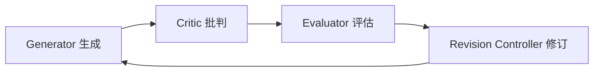
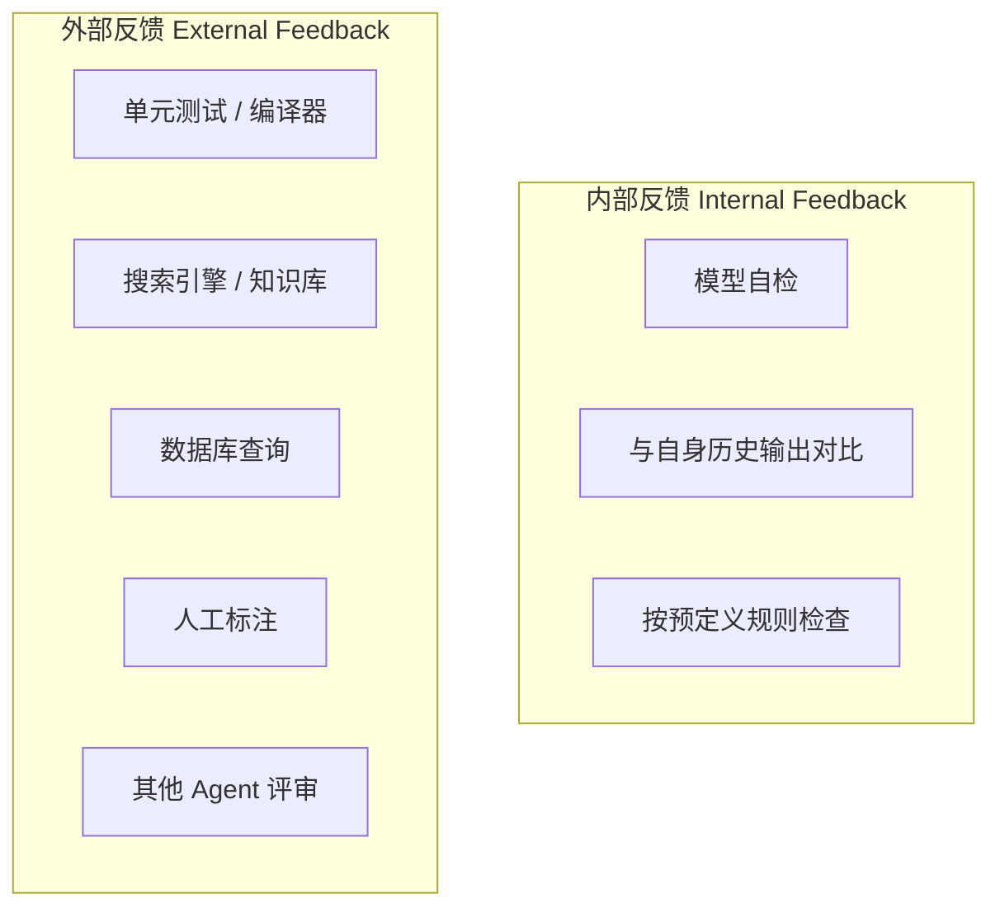
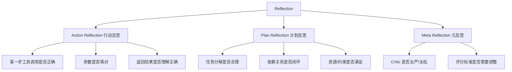
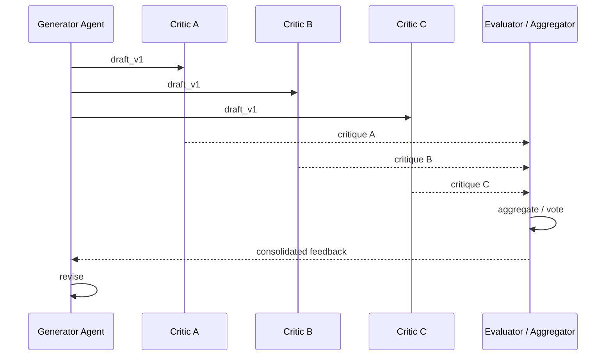
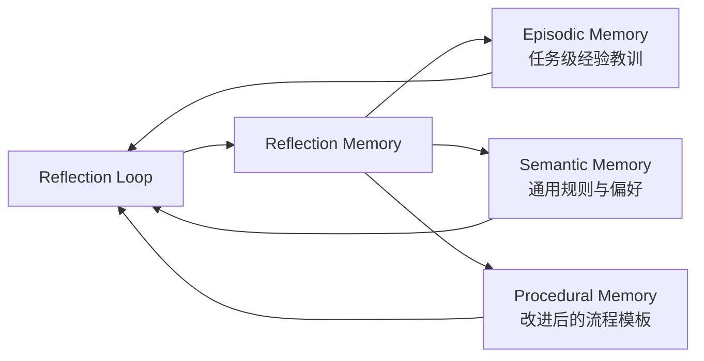

# 2. 核心思想

> 一句话理解：**Agent Reflection 的核心思想是把“生成答案”拆成“生成—批判—评估—修订”的闭环，让 Agent 主动发现自己的错误，并用量化反馈驱动定向改进**。

## 1. 生成 + 批判 + 评估 + 修订

Reflection 的最小闭环包含四个动作：



| 环节 | 职责 | 关键问题 |
|---|---|---|
| **Generator（生成器）** | 根据任务产出初稿或当前最优解 | 给定目标，输出什么？ |
| **Critic（批判者）** | 检查生成结果的问题，输出结构化反馈 | 哪里错了？为什么错？ |
| **Evaluator（评估者）** | 把批判结果量化成可比较的分数或判定 | 问题有多严重？是否值得修订？ |
| **Revision Controller（修订控制器）** | 根据评估结果决定如何修订、何时终止 | 怎么改？还要再改吗？ |

这个闭环可以运行一次，也可以运行多次，直到 Evaluator 认为结果足够好或达到最大迭代次数。

## 2. 内部反馈 vs 外部反馈

Critic 的信息来源分为两种：



| 类型 | 优点 | 缺点 | 适用场景 |
|---|---|---|---|
| **内部反馈** | 无需外部依赖、延迟低、覆盖全面 | 容易与 Generator 共享偏见、可能“自以为是” | 风格检查、结构检查、一致性检查 |
| **外部反馈** | 客观、可验证、能打破模型偏见 | 依赖外部系统、可能失败或返回噪声 | 代码编译、单元测试、事实检索、数值验证 |

生产系统中，内部反馈与外部反馈通常混合使用：内部反馈快速定位表面问题，外部反馈验证关键事实与约束。

## 3. 行动反思 vs 计划反思

Reflection 可以作用于不同层次：



| 类型 | 反思对象 | 例子 |
|---|---|---|
| **Action Reflection** | 具体动作或输出 | “这个 API 参数类型应该是 int 而不是 string” |
| **Plan Reflection** | 整体计划或分解 | “应该先写测试再写实现，而不是反过来” |
| **Meta Reflection** | 反思机制本身 | “Critic 对风格过于敏感，导致反复修改无意义细节” |

Action Reflection 成本低、见效快；Plan Reflection 能避免底层反复试错；Meta Reflection 用于长期优化 Reflection 策略本身。

## 4. 个体反思 vs 群体反思

| 维度 | 个体反思 Individual Reflection | 群体反思 Group Reflection |
|---|---|---|
| 参与者 | 单个 Agent 自我批判 | 多个 Agent 互相批判、投票、合并 |
| 成本 | 低，一次模型调用 | 高，多次 Agent 通信 |
| 偏见 | 容易陷入自我确认 | 不同角色提供多角度反馈 |
| 收敛 | 快 | 需要协调与聚合机制 |
| 代表 | Self-Refine、Reflexion | AutoGen Group Chat、Multi-Agent Review |

群体反思的典型模式：



生产实践中，个体反思是默认配置，群体反思只在高价值、高风险的场景启用。

## 5. 与 Memory 的集成

Reflection 本身会产生大量高价值信息： critique 文本、评分、修订记录、终止原因等。这些信息不应随任务结束而丢失，而应该写入 Memory：



| 沉淀内容 | 记忆类型 | 用途 |
|---|---|---|
| 某类错误的修复模式 | Episodic Memory | 下次遇到相似任务直接复用 |
| “用户喜欢简洁风格” | Semantic Memory | 在生成与修订时作为偏好输入 |
| 标准化检查清单 | Procedural Memory | 作为 Critic 的 system prompt 模板 |

Reflection 与 Memory 的结合，让 Agent 不仅“改好当前这一次”，还能“下次做得更好”。

## 6. Reflection 与 ReAct 的关系

Reflection 不是替代 ReAct，而是与之叠加：

```text
ReAct:   思考 → 行动 → 观察 → 思考 → ...
Reflection: 在每次“行动”或“回答”后增加“批判 → 评估 → 修订”
```

| 层级 | ReAct | Reflection |
|---|---|---|
| 关注点 | 怎么做、下一步做什么 | 做得对不对、怎么改更好 |
| 触发时机 | 每步行动前 | 关键节点或最终输出后 |
| 输出 | action / observation | critique / score / revision |
| 与 Memory 关系 | 读写上下文 | 沉淀经验教训 |

在实际系统中，ReAct 负责“往前走”，Reflection 负责“停下来看”。

## 7. Reflection 的收益与成本

### 收益

- **正确率提升**：通过多轮修订减少幻觉与低级错误。
- **可解释性增强**：Critic 的输出解释了“为什么改”。
- **可累积改进**：反思结果写入 Memory，形成组织级经验。
- **风险降低**：在高风险场景引入外部验证与人工兜底。

### 成本

- **延迟增加**：每轮 Reflection 至少增加一次模型调用。
- **费用增加**：多轮生成与批判都会消耗 token。
- **过度修改**：Critic 过严可能导致无意义循环。
- **错误修正错误**：Critic 本身也可能出错，导致“越改越差”。

因此，Reflection 应该**按需启用**，而不是无差别开启。

## 本章小结

Agent Reflection 的核心思想是把单轮生成扩展为“生成—批判—评估—修订”的迭代闭环。内部反馈与外部反馈各有优劣，应混合使用；行动反思、计划反思与元反思分别作用于不同抽象层次；个体反思成本低，群体反思质量高；与 Memory 结合后，反思结果可沉淀为长期经验。Reflection 不是替代 ReAct，而是与之叠加，在关键节点提供质量把关。

**参考来源**

- [Self-Refine: Iterative Refinement with Self-Feedback](https://arxiv.org/abs/2303.17651)
- [Reflexion: Self-Reflective Agents with Verbal Reinforcement Learning](https://arxiv.org/abs/2303.11366)
- [CRITIC: Large Language Models Can Self-Correct with Tool-Interactive Critiquing](https://arxiv.org/abs/2305.11738)
- [LangGraph Blog — Reflection Agents](https://blog.langchain.dev/reflection-agents/)
- [AutoGen Reflection](https://microsoft.github.io/autogen/stable/user-guide/agentchat-user-guide/tutorial/reflection.html)
