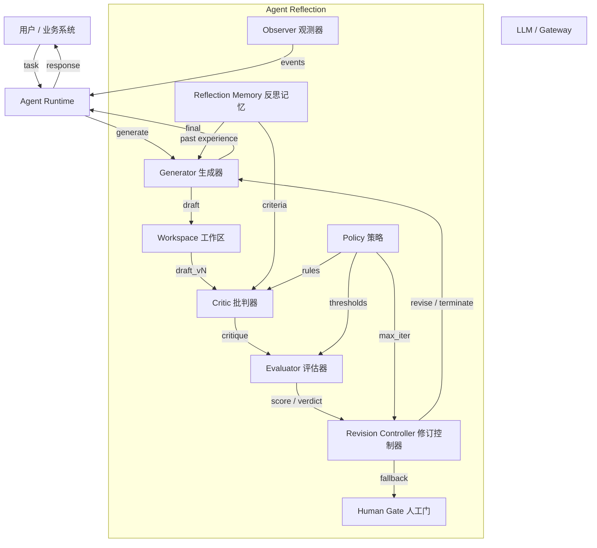
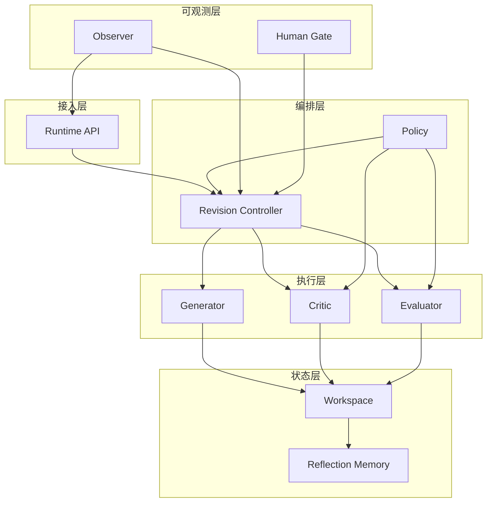
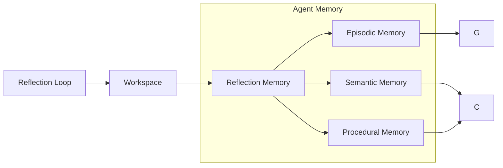
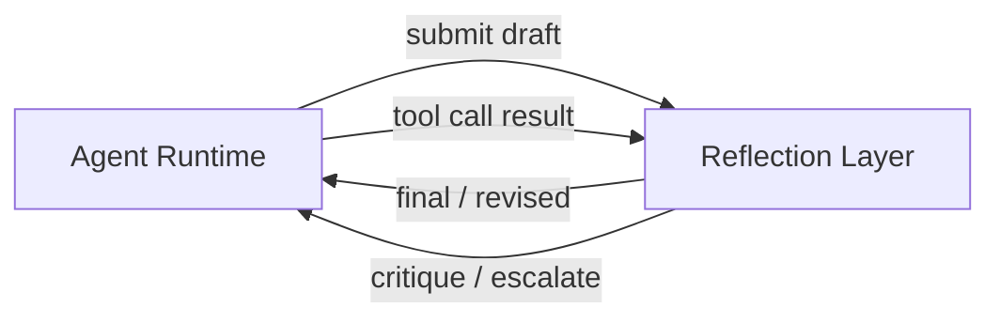

# 3. 架构设计

> 一句话理解：**Agent Reflection 的架构可以概括为“生成器产出草稿，批判器发现问题，评估器量化质量，修订控制器驱动迭代，工作区保存中间产物，反思记忆沉淀经验”**。

## 整体架构



## 核心组件职责

| 组件 | 职责 | 典型输入 | 典型输出 |
|---|---|---|---|
| **Generator** | 根据任务与反馈生成或修订答案 | task、history、critique | draft / revision |
| **Critic** | 检查 draft 的问题，输出结构化反馈 | draft、criteria、context | critique list |
| **Evaluator** | 把 critique 量化为分数或终止判定 | critique、metrics、thresholds | score / pass/fail |
| **Revision Controller** | 决定继续修订、终止还是升级人工 | score、iteration、policy | revise / terminate / escalate |
| **Workspace** | 保存多轮草稿、批判、评分与最终答案 | drafts、critiques、scores | versioned artifacts |
| **Reflection Memory** | 沉淀历史反思经验与通用规则 | critique、score、final | episodic / semantic / procedural memory |
| **Policy** | 定义反思策略、评分标准、终止条件 | business rules | criteria、thresholds、max_iter |
| **Observer** | 记录反思循环事件与 trace | all events | logs、metrics、traces |
| **Human Gate** | 人工兜底与审核入口 | escalation event | approval / correction / rejection |

## 分层职责



| 层级 | 职责 | 典型组件 |
|---|---|---|
| **接入层** | 接收 Runtime 的反思请求，返回最终结果 | Runtime API、Gateway |
| **编排层** | 控制循环节奏、终止判定、人工升级 | Revision Controller、Policy |
| **执行层** | 实际执行生成、批判、评估 | Generator、Critic、Evaluator |
| **状态层** | 保存草稿版本与反思记忆 | Workspace、Reflection Memory |
| **可观测层** | 记录 trace、metrics、审计、人工兜底 | Observer、Human Gate |

## 控制面 vs 数据面

| 维度 | 控制面 | 数据面 |
|---|---|---|
| 职责 | 策略、评分标准、终止条件、人工升级规则 | 生成、批判、评分、修订、记忆写入 |
| 状态 | 长期配置、策略版本 | 会话级草稿与历史版本 |
| 扩展 | 策略中心、配置管理 | 水平扩展 Generator/Critic/Evaluator worker |
| 示例 | “代码必须零 warning 才能终止”“最大迭代 3 次” | 一次 critique 调用、一次 draft 写入 |

控制面决定“什么时候反思、反思到什么程度”，数据面决定“具体怎么生成、怎么批判、怎么评分”。

## 控制流与数据流

### 控制流

```text
Runtime → Revision Controller → Generator / Critic / Evaluator → Revision Controller → (iterate | terminate | escalate)
```

### 数据流

```text
Generator(draft) → Workspace → Critic(critique) → Evaluator(score) → Revision Controller(decision) → Workspace / Memory
```

## Workspace 设计

Workspace 是 Reflection 的“草稿纸”，需要保存：

```text
{
  task: "...",
  versions: [
    { id: 1, draft: "...", critique: "...", score: 0.4, revised_from: null },
    { id: 2, draft: "...", critique: "LGTM", score: 1.0, revised_from: 1 }
  ],
  final_version: 2,
  termination_reason: "score >= threshold"
}
```

Workspace 可以是内存对象、数据库记录、对象存储文件或向量数据库中的 trace。

## Reflection Memory 设计

Reflection Memory 与 Agent Memory 的关系：



Reflection Memory 可以把以下信息写入 Agent Memory：

- **Episodic**：本次任务的失败模式与修复方式。
- **Semantic**：用户或业务领域的通用偏好与约束。
- **Procedural**：改进后的检查清单、Critic prompt 模板。

## 与 Runtime、Memory、Multi-Agent 的集成

### 与 Runtime 集成



Runtime 负责：

- 在关键节点调用 Reflection。
- 把工具结果、用户反馈传给 Reflection。
- 处理 Reflection 返回的修订结果或升级事件。

### 与 Memory 集成

Runtime 在 Reflection 结束后把关键经验写入 Memory；Memory 在后续任务中为 Generator 和 Critic 提供历史上下文。

### 与 Multi-Agent 集成

在 Multi-Agent 场景中，Reflection 可以是：

- **个体反思**：每个 Agent 内部有自己的 Reflection Layer。
- **群体反思**：一个专门的 Critic Agent 或多个 Reviewer Agent 对其他 Agent 的输出进行批判。

## 部署形态

### 形态 1：库 / SDK

业务进程直接 import reflection 库，调用 `reflect(draft)`。

优点：低延迟、易集成。
缺点：策略与状态分散，难以跨进程共享。

### 形态 2：独立服务

```text
Agent Runtime → Reflection Service → LLM Gateway
                           ↓
                    Reflection Memory / Workspace
```

优点：集中管理策略、可扩展、可观测统一。
缺点：多一跳网络延迟。

### 形态 3：Sidecar

与 Runtime 进程一起部署，适合高隔离、多租户场景。

### 形态 4：Serverless / 托管

使用云厂商或框架提供的托管 Reflection 能力，例如 LangGraph Cloud、AutoGen 托管运行时。

## 本章小结

Agent Reflection 的架构核心是“生成—批判—评估—修订”的闭环。Generator、Critic、Evaluator 是执行层，Revision Controller 和 Policy 是编排层，Workspace 和 Reflection Memory 是状态层，Observer 和 Human Gate 是可观测与兜底层。控制面负责策略与终止条件，数据面负责高并发的生成与批判。部署形态可以是库、独立服务、Sidecar 或托管，选择取决于延迟、隔离和可扩展需求。

**参考来源**

- [Self-Refine: Iterative Refinement with Self-Feedback](https://arxiv.org/abs/2303.17651)
- [Reflexion: Self-Reflective Agents with Verbal Reinforcement Learning](https://arxiv.org/abs/2303.11366)
- [CRITIC: Large Language Models Can Self-Correct with Tool-Interactive Critiquing](https://arxiv.org/abs/2305.11738)
- [LangGraph Reflection Tutorial](https://langchain-ai.github.io/langgraph/tutorials/reflection/reflection/)
- [AutoGen Reflection](https://microsoft.github.io/autogen/stable/user-guide/agentchat-user-guide/tutorial/reflection.html)
- [LangGraph Blog — Reflection Agents](https://blog.langchain.dev/reflection-agents/)
