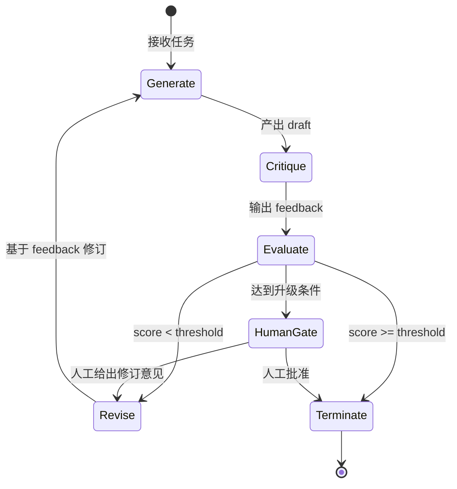
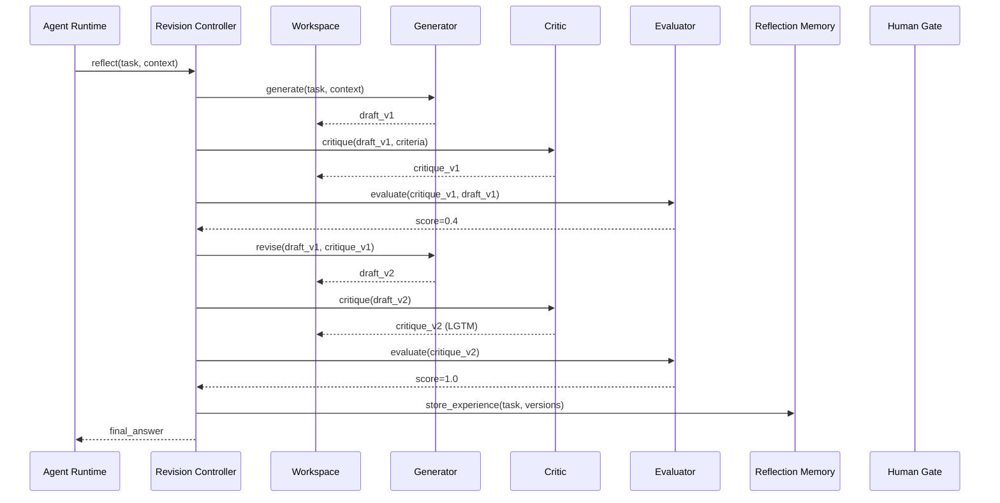
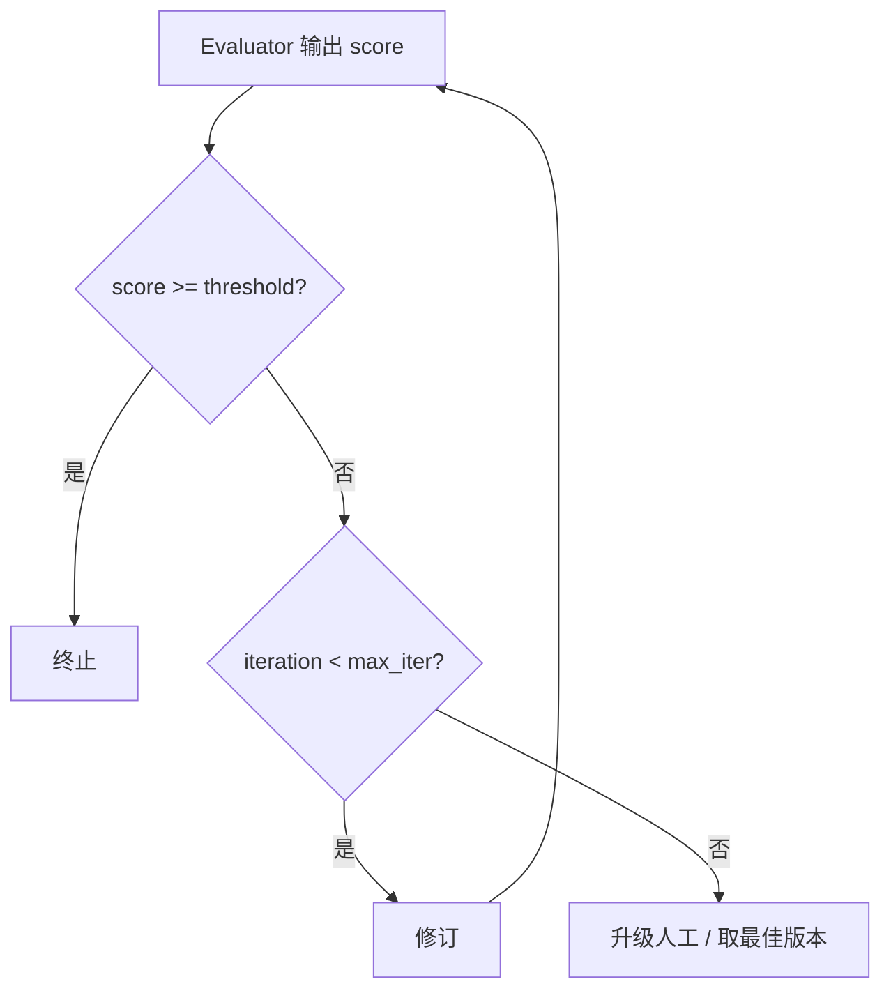
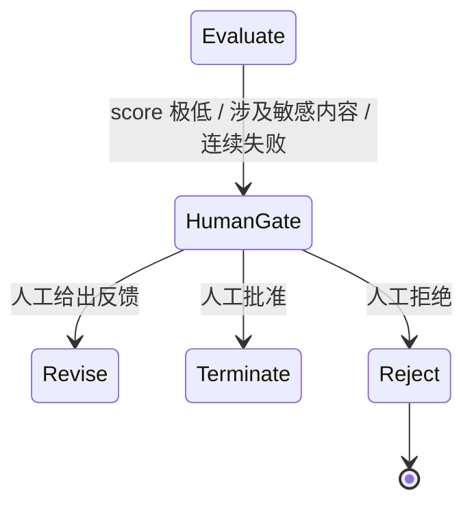

# 4. 反思循环

> 一句话理解：**反思循环是 Agent Reflection 的引擎，它按照“生成 → 批判 → 评分 → 修订 → 终止”的节拍反复运转，直到答案满足质量标准或触发兜底策略**。

## 循环概览



## 完整时序



## 各环节详解

### 1. Generate（生成）

Generator 接收任务和上下文，产出当前版本的 draft。第一轮只依赖任务本身；后续轮次需要依赖 Critic 的 feedback。

输入：

```text
- task: 用户原始请求
- context: 历史对话、工具结果、Memory 中的相关经验
- critique: 上一轮的批判反馈（第 2+ 轮）
```

输出：

```text
- draft: 当前版本的生成结果
```

### 2. Critique（批判）

Critic 根据 Policy 中定义的 criteria 检查 draft。Criteria 可以是：

- 事实准确性
- 格式符合要求
- 代码可编译、通过测试
- 风格一致性
- 约束满足度

输出应该是结构化的，例如：

```json
{
  "issues": [
    {"severity": "major", "location": "paragraph 2", "description": "概念混淆：Reflection 与 ReAct 未区分"},
    {"severity": "minor", "location": "overall", "description": "可增加一个具体例子"}
  ],
  "verdict": "needs_revision"
}
```

### 3. Evaluate（评估）

Evaluator 把 Critic 的输出量化为可比较的指标。常见做法：

| 评估方式 | 说明 | 适用 |
|---|---|---|
| **标量分数** | 0~1 之间的小数 | 通用，便于设置阈值 |
| **等级判定** | pass / minor / major / block | 分类清晰，便于人工阅读 |
| **多维评分** | 按准确性、完整性、风格等维度分别打分 | 需要精细分析的场景 |
| **二值判定** | LGTM / not LGTM | 简单直接，适合代码审查 |

示例：

```text
score = weighted_average(accuracy=0.9, completeness=0.7, style=0.8) = 0.80
threshold = 0.85
verdict = revise
```

### 4. Revise（修订）

Revision Controller 根据 Evaluator 的结果决定：

- **继续修订**：把 critique 返回给 Generator，进入下一轮。
- **终止循环**：score 达到 threshold，输出最终答案。
- **人工升级**：触发 Human Gate。

### 5. Terminate（终止）

终止条件见下一节。

## 终止条件

终止条件是 Reflection Loop 的“刹车系统”。常见终止条件包括：

| 条件 | 说明 | 风险 |
|---|---|---|
| **质量达标** | score >= threshold | threshold 设置不当可能导致过早/过晚终止 |
| **最大迭代次数** | iteration >= max_iter | 必须设置，防止无限循环 |
| **改进饱和** | 连续 N 轮 score 提升 < delta | 避免在收益递减时继续浪费 token |
| **Critic 无新意见** | 本轮 critique 与上轮基本相同 | 防止反复修改同一问题 |
| **外部验证通过** | 单元测试全部通过 / 编译无错 | 客观条件满足即可终止 |
| **人工批准** | Human Gate 认为可以终止 | 适合高风险场景 |



## 最大迭代护栏

max_iter 是生产环境必须配置的硬上限。设置建议：

| 场景 | 建议 max_iter | 原因 |
|---|---|---|
| 简单文本润色 | 2~3 | 改进空间有限 |
| 代码生成 | 3~5 | 需要多轮编译/测试修复 |
| 复杂规划 | 5~7 | 计划层面的反思需要更多轮次 |
| 多 Agent 审稿 | 2~3 轮审稿 | 群体反思成本高 |

超过 max_iter 后的兜底策略：

- 返回历史版本中 score 最高的一个。
- 触发 Human Gate 人工审核。
- 降级处理：返回“当前最佳尝试 + 已知问题列表”。

## HITL 分支

Human-in-the-Loop（HITL）是 Reflection Loop 的重要安全网。



触发 HITL 的典型条件：

- 连续多轮无法达到 threshold。
- Critic 发现涉及安全、合规、伦理问题。
- Evaluator 分数波动剧烈，系统不确定是否可靠。
- 任务属于高风险领域（如医疗、法律、金融）。

## 失败模式与应对

| 失败模式 | 现象 | 应对 |
|---|---|---|
| **Critic 过严** | 反复修改无意义细节，score 始终不达标 | 收紧 criteria、降低 Critic 温度、使用更小的 Critic 模型 |
| **Critic 过松** | 明显错误被忽略，过早终止 | 增加外部验证工具、细化 criteria |
| **Generator 不改** | 多轮输出几乎相同 | 强制要求逐条回应 critique、提高 revise prompt 的约束 |
| **越改越差** | score 下降 | 引入回滚机制，保留历史最佳版本 |
| **外部工具失败** | 编译器/测试不可用 | 降级为内部反馈 + 标记待人工确认 |

## 本章小结

反思循环是 Agent Reflection 的执行核心，按照“生成 → 批判 → 评估 → 修订 → 终止”的顺序反复运转。终止条件包括质量达标、最大迭代次数、改进饱和、外部验证通过和人工批准。max_iter 是必须配置的硬护栏，HITL 是高风险场景的安全网。实际运行中需要警惕 Critic 过严/过松、Generator 不改、越改越差等失败模式。

**参考来源**

- [Self-Refine: Iterative Refinement with Self-Feedback](https://arxiv.org/abs/2303.17651)
- [Reflexion: Self-Reflective Agents with Verbal Reinforcement Learning](https://arxiv.org/abs/2303.11366)
- [CRITIC: Large Language Models Can Self-Correct with Tool-Interactive Critiquing](https://arxiv.org/abs/2305.11738)
- [LangGraph Reflection Tutorial](https://langchain-ai.github.io/langgraph/tutorials/reflection/reflection/)
- [LangGraph Blog — Reflection Agents](https://blog.langchain.dev/reflection-agents/)
