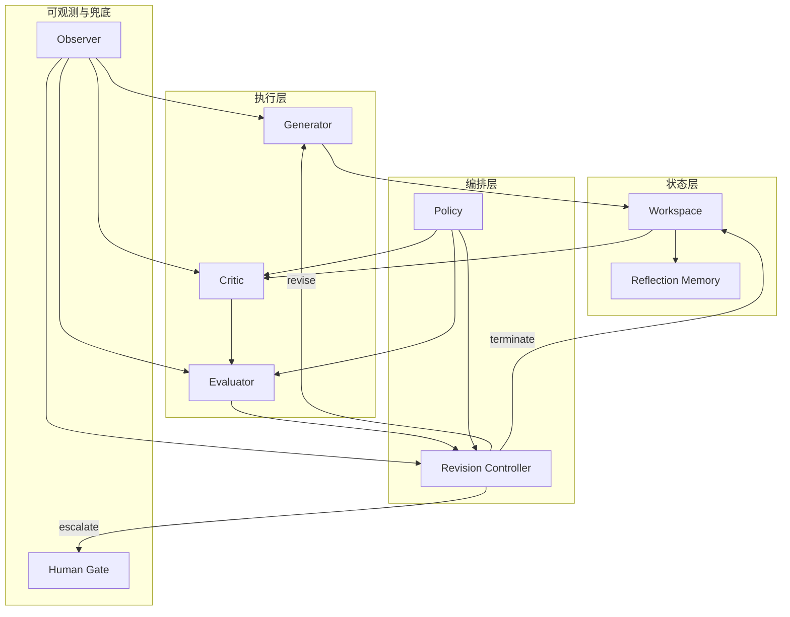
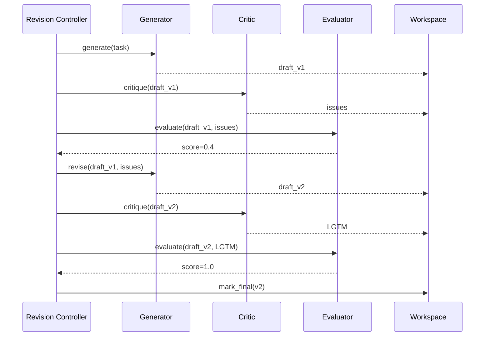

# 5. 核心模块

> 一句话理解：**Agent Reflection 的核心模块各司其职：Generator 负责产出，Critic 负责挑错，Evaluator 负责打分，Revision Controller 负责循环控制，Workspace 和 Reflection Memory 负责状态与经验沉淀**。

## 模块职责总览



## Generator（生成器）

### 职责

- 根据任务、上下文和上一轮 critique 生成 draft。
- 在修订轮次中，必须显式回应 Critic 的每条意见。

### 输入

```python
{
    "task": str,           # 用户原始请求
    "context": dict,       # 历史对话、工具结果、Memory
    "critique": list,      # 上一轮 Critic 反馈（可选）
    "version": int,        # 当前轮次
}
```

### 输出

```python
{
    "draft": str,          # 当前版本生成结果
    "metadata": dict,      # 生成参数、模型、温度等
}
```

### 关键接口示例

```python
class Generator:
    def generate(self, task: str, context: dict, critique: list | None = None) -> dict:
        prompt = self._build_prompt(task, context, critique)
        response = self.llm_client.chat(prompt)
        return {"draft": response, "metadata": {"model": self.model}}
```

### 生产注意

- 使用与 Critic 不同的 prompt 模板，避免角色混淆。
- 修订 prompt 必须要求“逐条回应 critique”，否则 Generator 容易忽略反馈。
- 可在 prompt 中注入 Reflection Memory 中的成功案例或用户偏好。

## Critic（批判器）

### 职责

- 根据 Policy 定义的 criteria 检查 draft。
- 输出结构化、可操作的反馈。

### 输入

```python
{
    "draft": str,
    "criteria": list[str], # 检查维度
    "context": dict,       # 外部验证结果、历史版本
}
```

### 输出

```python
{
    "issues": [
        {"severity": "major|minor|info", "location": str, "description": str, "suggestion": str}
    ],
    "verdict": "needs_revision|lgtm|uncertain",
    "metadata": dict,
}
```

### 关键接口示例

```python
class Critic:
    def critique(self, draft: str, criteria: list[str], context: dict) -> dict:
        prompt = self._build_critique_prompt(draft, criteria, context)
        response = self.llm_client.chat(prompt)
        return self._parse_critique(response)
```

### 生产注意

- Critic 模型可以与 Generator 相同，也可以使用更小、更快的专用模型。
- Criteria 必须具体、可验证，避免模糊要求如“写得好一点”。
- 对关键任务应引入外部工具验证（编译器、单元测试、检索），而非仅依赖模型自检。

## Evaluator（评估器）

### 职责

- 把 Critic 的输出量化为 score 或判定。
- 决定本轮是否满足终止条件。

### 输入

```python
{
    "draft": str,
    "critique": dict,
    "metrics": list[str],  # 评估维度
    "thresholds": dict,    # 各维度阈值
}
```

### 输出

```python
{
    "score": float,        # 0~1
    "scores_per_metric": dict,
    "verdict": "pass|revise|escalate",
    "reason": str,
}
```

### 关键接口示例

```python
class Evaluator:
    def evaluate(self, draft: str, critique: dict, metrics: list[str], thresholds: dict) -> dict:
        if self.use_rule_based:
            return self._rule_evaluate(critique, thresholds)
        return self._llm_evaluate(draft, critique, metrics, thresholds)
```

### 生产注意

- 规则评估速度快、稳定，但难以覆盖复杂场景。
- LLM 评估更灵活，但成本高、一致性差。
- 关键维度（如安全、合规）建议用规则兜底。

## Revision Controller（修订控制器）

### 职责

- 管理 Reflection Loop 的状态机。
- 决定继续修订、终止还是升级人工。
- 处理 max_iter、改进饱和、版本回滚等策略。

### 输入

```python
{
    "evaluation": dict,
    "workspace": Workspace,
    "policy": Policy,
}
```

### 输出

```python
{
    "decision": "revise|terminate|escalate",
    "target_version": int | None,
    "reason": str,
}
```

### 关键接口示例

```python
class RevisionController:
    def decide(self, evaluation: dict, workspace: Workspace, policy: Policy) -> dict:
        if evaluation["verdict"] == "pass":
            return {"decision": "terminate", "reason": "score above threshold"}
        if workspace.iteration >= policy.max_iter:
            return {"decision": "escalate", "reason": "max iteration reached"}
        if workspace.improvement_saturated(policy.delta):
            return {"decision": "terminate", "reason": "improvement saturated"}
        return {"decision": "revise", "target_version": workspace.latest_version}
```

### 生产注意

- Revision Controller 必须记录完整决策日志，便于审计。
- 支持 A/B 测试不同策略（如 threshold 调整）。
- 升级人工时应附带完整的 workspace 上下文。

## Workspace（工作区）

### 职责

- 保存所有版本及其元数据。
- 提供版本比较、回滚、最佳版本选择。

### 关键接口示例

```python
class Workspace:
    def add_version(self, draft: str, critique: dict | None, score: float | None) -> int:
        ...

    def get_version(self, version_id: int) -> dict:
        ...

    def get_best_version(self) -> dict:
        return max(self.versions, key=lambda v: v.score)

    def rollback(self, version_id: int) -> None:
        ...
```

### 生产注意

- Workspace 应支持持久化，避免任务中断丢失进度。
- 对长文本 draft，应支持 diff 视图，便于人工审查。
- 版本数过多时需要压缩或归档。

## Reflection Memory（反思记忆）

### 职责

- 把反思过程中产生的经验写入 Agent Memory。
- 在后续任务中为 Generator 和 Critic 提供上下文。

### 关键接口示例

```python
class ReflectionMemory:
    def store_episode(self, task: str, versions: list, final: dict) -> str:
        ...

    def recall_similar(self, task: str, top_k: int = 3) -> list:
        ...

    def store_rule(self, rule: str, scope: str) -> str:
        ...
```

### 生产注意

- 只沉淀高价值经验，避免把每次反思都写入 Memory 导致噪声。
- 经验需要定期人工审核，防止错误模式被固化。
- 与 Agent Memory 的存储后端复用，降低维护成本。

## Policy（策略）

### 职责

- 定义 criteria、thresholds、max_iter、兜底策略等。
- 支持按任务类型、用户、模型动态选择策略。

### 关键接口示例

```python
@dataclass
class ReflectionPolicy:
    criteria: list[str]
    metrics: list[str]
    thresholds: dict[str, float]
    max_iter: int
    delta: float
    escalation_on_max_iter: bool
    tools: list[str] | None
```

### 生产注意

- Policy 应该版本化管理，便于回滚与 A/B 测试。
- 不同业务场景使用不同 Policy，避免一刀切。
- 策略变更需要与评估基准联动，避免盲目调整。

## Observer（观测器）

### 职责

- 记录 Reflection Loop 中的关键事件。
- 输出 trace、metrics、审计日志。

### 关键事件

- generate_start / generate_end
- critique_start / critique_end
- evaluate_result
- revision_decision
- memory_write
- human_escalation

### 生产注意

- Observer 不应阻塞主循环，建议异步发送事件。
- 关键指标：平均迭代次数、终止原因分布、平均 score、人工升级率。

## Human Gate（人工门）

### 职责

- 接收 Revision Controller 的升级请求。
- 提供人工审核、修正、批准或拒绝的入口。

### 关键接口示例

```python
class HumanGate:
    def request_review(self, workspace: Workspace, reason: str) -> dict:
        ...

    def submit_feedback(self, review_id: str, feedback: dict) -> None:
        ...
```

### 生产注意

- Human Gate 需要展示完整的版本历史和 diff。
- 人工反馈本身也应作为训练数据或 Memory 沉淀。
- 对低风险任务可配置自动批准规则，减少人工负担。

## 模块协作示例



## 本章小结

Agent Reflection 的核心模块包括 Generator、Critic、Evaluator、Revision Controller、Workspace、Reflection Memory、Policy、Observer 和 Human Gate。Generator 产出 draft，Critic 检查问题，Evaluator 量化质量，Revision Controller 控制循环，Workspace 保存版本，Reflection Memory 沉淀经验，Policy 提供策略配置，Observer 记录事件，Human Gate 提供人工兜底。各模块通过清晰的输入输出接口协作，构成可扩展、可观测的反思系统。

**参考来源**

- [Self-Refine: Iterative Refinement with Self-Feedback](https://arxiv.org/abs/2303.17651)
- [Reflexion: Self-Reflective Agents with Verbal Reinforcement Learning](https://arxiv.org/abs/2303.11366)
- [CRITIC: Large Language Models Can Self-Correct with Tool-Interactive Critiquing](https://arxiv.org/abs/2305.11738)
- [LangGraph Reflection Tutorial](https://langchain-ai.github.io/langgraph/tutorials/reflection/reflection/)
- [AutoGen Reflection](https://microsoft.github.io/autogen/stable/user-guide/agentchat-user-guide/tutorial/reflection.html)
- [LangGraph Blog — Reflection Agents](https://blog.langchain.dev/reflection-agents/)
