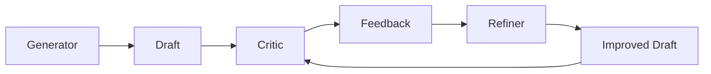
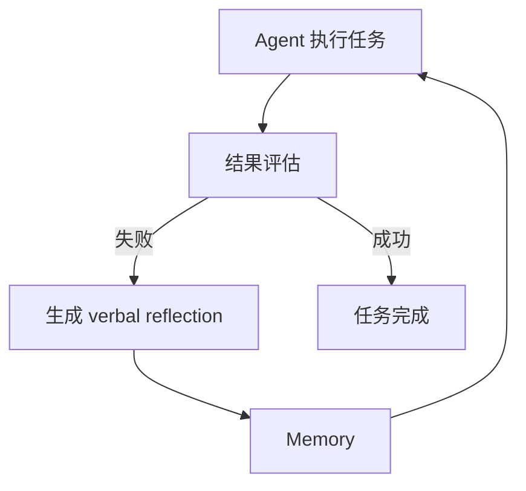
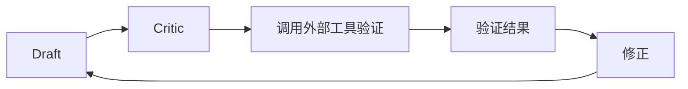
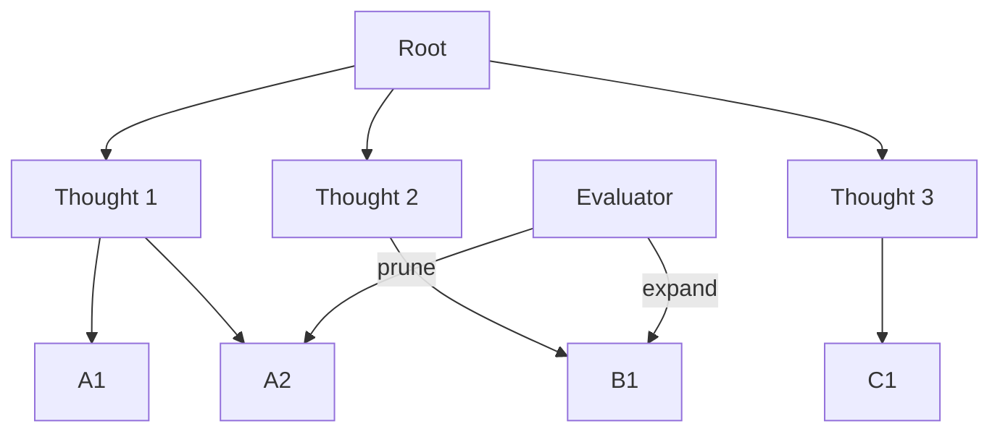
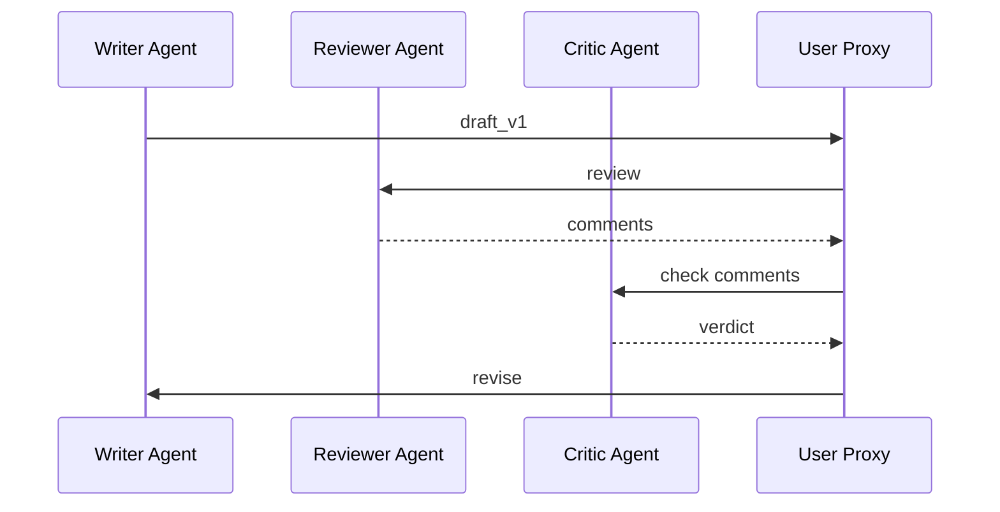

# 6. 源码分析

> 一句话理解：**主流 Reflection 实现各有侧重：Self-Refine 强调单模型自迭代，Reflexion 把反思写入记忆，CRITIC 引入外部工具验证，Tree of Thoughts 用搜索拓展解空间，LangGraph 与 AutoGen 提供工程化编排，OpenAI o1 则把反思内隐到模型推理中**。

## 主流方案对比

| 方案 | 核心思想 | 反馈来源 | 是否写 Memory | 典型场景 |
|---|---|---|---|---|
| **Self-Refine** | 同一个模型轮流生成与批判 | 内部反馈 | 否 | 文本润色、简单推理 |
| **Reflexion** | 把 verbal reinforcement 写入记忆 | 内部反馈 + 任务结果 | 是 | 长期任务、连续学习 |
| **CRITIC** | 调用外部工具验证并修正 | 外部反馈 | 否 | 代码、事实、数学 |
| **Tree of Thoughts** | 在思维树上搜索并剪枝 | 内部/外部评估 | 否 | 数学、规划、组合优化 |
| **LangGraph Reflection** | 用图节点编排生成—反思循环 | 内部/外部均可 | 可选 | 生产级 Agent 工作流 |
| **AutoGen Reflection** | 多 Agent 互相批判 | 内部/外部均可 | 可选 | 多角色审稿、代码审查 |
| **OpenAI o1 / Reasoning Models** | 模型内部长链推理与自我修正 | 内部 | 否（模型内隐） | 复杂推理、数学、代码 |

## Self-Refine

Self-Refine 是最早系统化的单模型 Reflection 方案之一。

### 核心流程



### 设计要点

- **同一模型担任多角色**：通过不同 prompt 让模型在 Generator、Critic、Refiner 之间切换。
- **无外部依赖**：完全依赖模型自身的批判能力。
- **零记忆**：每次任务独立，不累积经验。

### 优点与局限

| 优点 | 局限 |
|---|---|
| 实现简单 | Critic 容易与 Generator 共享偏见 |
| 无需外部工具 | 对需要客观验证的任务效果有限 |
| 适合文本生成类任务 | 不积累经验 |

### 工程启示

Self-Refine 证明了“生成—批判—修订”闭环的有效性，但生产环境通常需要外部验证和记忆沉淀。

## Reflexion

Reflexion 在 Self-Refine 基础上增加了**记忆机制**，让 Agent 能从失败中学习。

### 核心流程



### 设计要点

- **Verbal Reinforcement Learning**：用语言形式的反思替代传统强化学习的数值奖励。
- **Memory 分两类**：
  - **Short-term Memory**：当前 episode 的近期经验。
  - **Long-term Memory**：跨 episode 累积的经验教训。
- **Self-reflection model**：专门负责生成反思文本。

### 优点与局限

| 优点 | 局限 |
|---|---|
| 经验可跨任务复用 | 反思文本质量直接影响效果 |
| 适合长期连续任务 | 记忆膨胀需要管理 |
| 可解释性强 | 对需要外部验证的任务仍需扩展 |

### 工程启示

Reflexion 告诉我们：Reflection 的价值不仅在于“改好这一次”，更在于“让下一次更好”。

## CRITIC

CRITIC 强调**外部工具验证**，是代码生成和事实校验场景的重要参考。

### 核心流程



### 设计要点

- **Tool-interactive critiquing**：Critic 不只做文本检查，还会主动调用工具。
- **Verify-then-correct**：先验证，再基于验证结果修正。
- 支持的工具包括：搜索引擎、代码解释器、计算器、数据库等。

### 优点与局限

| 优点 | 局限 |
|---|---|
| 反馈客观可验证 | 工具调用增加延迟和成本 |
| 适合代码、事实、数学 | 工具覆盖范围决定上限 |
| 能打破模型幻觉 | 工具本身也可能出错 |

### 工程启示

CRITIC 是生产系统的关键参考：对于可客观验证的任务，内部 Critic 必须叠加外部工具验证。

## Tree of Thoughts

Tree of Thoughts（ToT）不是严格意义上的 Reflection，但它与 Reflection 高度互补：ToT 负责**在解空间中搜索**，Reflection 负责**评估和修正每个节点**。

### 核心流程



### 设计要点

- **思维作为节点**：每个节点是一个中间推理步骤。
- **搜索策略**：BFS、DFS、Beam Search。
- **Evaluator 打分**：对每个节点进行价值评估，决定剪枝或扩展。

### 与 Reflection 的关系

| ToT | Reflection |
|---|---|
| 在多个候选中搜索 | 对单个候选迭代改进 |
| 节点级评估 | 整稿级评估 |
| 适合解空间大的问题 | 适合需要精细打磨的问题 |

工程上可以把两者结合：ToT 生成多个候选，Reflection 对每个候选精细打磨，最后选最优。

## LangGraph Reflection

LangGraph 把 Reflection 表达为**状态图（StateGraph）**，适合生产级编排。

### 典型结构


### 设计要点

- **状态驱动**：整个循环的状态（draft、critique、iteration）显式保存在 State 中。
- **节点即函数**：Generate、Reflect 都是普通 Python 函数，便于测试和复用。
- **边即条件**：通过条件边决定继续循环还是终止。
- **可持久化**：支持 checkpoint，任务中断后可恢复。

### 生产优势

| 优势 | 说明 |
|---|---|
| 可视化 | 图结构清晰，便于理解和调试 |
| 可扩展 | 节点可独立升级、替换 |
| 可观测 | 每个节点的输入输出都能被 trace |
| 可恢复 | checkpoint 支持失败恢复 |

### 关键代码模式

```python
from langgraph.graph import StateGraph, END

graph = StateGraph(State)
graph.add_node("generate", generate_node)
graph.add_node("reflect", reflect_node)
graph.set_entry_point("generate")
graph.add_edge("generate", "reflect")
graph.add_conditional_edges("reflect", should_continue, {"continue": "generate", "end": END})
```

## AutoGen Reflection

AutoGen 的 Reflection 主要体现在**多 Agent 对话**中，一个 Agent 可以专门扮演 Critic 或 Reviewer。

### 典型模式



### 设计要点

- **ConversableAgent**：每个 Agent 都能发送和接收消息。
- **GroupChat**：多个 Agent 在群聊中协作。
- **Reflect 模式**：可以在对话中插入反思轮次。

### 生产优势

| 优势 | 说明 |
|---|---|
| 角色分离 | Generator 与 Critic 可以是不同模型或不同配置 |
| 群体智慧 | 多个 Critic 提供多角度反馈 |
| 灵活 | 可嵌入到复杂多 Agent 工作流 |

## OpenAI o1 / Reasoning Models

OpenAI o1 系列把 Reflection 内隐到模型内部，通过**长链推理（long internal reasoning）**实现自我修正。

### 特点

- 模型在内部生成大量 reasoning tokens，不对外暴露。
- 能够识别并修正自己推理链中的错误。
- 在数学、代码、科学推理任务上表现突出。

### 与显式 Reflection 的关系

| OpenAI o1 | 显式 Reflection 系统 |
|---|---|
| 反思过程在模型内部 | 反思过程在外部系统编排 |
| 不可控、不可观测 | 可控、可观测、可定制 |
| 适合通用推理 | 适合业务规则明确的任务 |

### 工程启示

Reasoning models 可以作为 Generator 或 Critic 的底层模型，但不应完全替代显式 Reflection 系统，因为后者提供可控性、记忆沉淀和外部验证能力。

## 如何选择

| 需求 | 推荐方案 |
|---|---|
| 快速原型、文本润色 | Self-Refine |
| 长期学习、跨任务改进 | Reflexion |
| 代码生成、事实校验 | CRITIC |
| 复杂规划、解空间大 | Tree of Thoughts + Reflection |
| 生产级工作流 | LangGraph Reflection |
| 多角色审稿 | AutoGen Reflection |
| 底层推理能力 | OpenAI o1 / 其他 reasoning models |

## 本章小结

Self-Refine 奠定了单模型自迭代的基础，Reflexion 增加了记忆让经验可复用，CRITIC 引入外部工具实现客观验证，Tree of Thoughts 在解空间层面与 Reflection 互补，LangGraph 和 AutoGen 提供了工程化的编排能力，OpenAI o1 则把反思内隐到模型长链推理中。生产系统通常需要组合使用：显式 Reflection 负责可控性与记忆沉淀，外部工具负责客观验证，reasoning models 提供底层推理能力。

**参考来源**

- [Self-Refine: Iterative Refinement with Self-Feedback](https://arxiv.org/abs/2303.17651)
- [Reflexion: Self-Reflective Agents with Verbal Reinforcement Learning](https://arxiv.org/abs/2303.11366)
- [CRITIC: Large Language Models Can Self-Correct with Tool-Interactive Critiquing](https://arxiv.org/abs/2305.11738)
- [Tree of Thoughts: Deliberate Problem Solving with Large Language Models](https://arxiv.org/abs/2305.10601)
- [LangGraph Reflection Tutorial](https://langchain-ai.github.io/langgraph/tutorials/reflection/reflection/)
- [AutoGen Reflection](https://microsoft.github.io/autogen/stable/user-guide/agentchat-user-guide/tutorial/reflection.html)
- [OpenAI o1 / Reasoning Models](https://openai.com/index/learning-to-reason-with-llms/)
- [LangGraph Blog — Reflection Agents](https://blog.langchain.dev/reflection-agents/)
