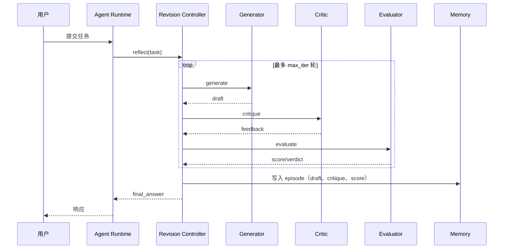

# 8. 企业生产实践

> 一句话理解：**生产级 Reflection 不是把 Generator 和 Critic 简单串起来，而是一套涉及模型选型、评分校准、在线/离线闭环、Runtime/Memory 集成、评测基准和人工兜底的系统工程**。

## 何时启用 Reflection

不是所有任务都值得反思。启用 Reflection 的典型信号：

| 信号 | 说明 |
|---|---|
| 单轮 LLM 错误率明显偏高 | 如代码生成、复杂规划、长文本写作 |
| 错误成本较高 | 如金融、法律、医疗、安全相关输出 |
| 有明确的评估标准 | 如代码可编译、测试通过、格式固定 |
| 允许额外延迟 | 反思通常增加 1~3 倍延迟，实时性强的场景慎用 |
| 有高质量 Critic 或验证工具 | 如单元测试、编译器、检索系统、专家规则 |

不建议开启的场景：

- 低延迟要求的对话补全（如客服首句回复）。
- 创意发散任务，过度反思会扼杀多样性。
- 评估标准模糊、人工都难以判断好坏的任务。

## Critic 模型选型

Critic 是 Reflection 系统的“质量守门人”，其选型直接影响反思效果。

| 选型 | 适用场景 | 优点 | 缺点 |
|---|---|---|---|
| **主模型自身兼任 Critic** | 资源受限、通用任务 | 无需额外部署，上下文一致 | 容易陷入自我偏好，批判不够独立 |
| **独立同尺寸模型** | 需要客观批判 | 视角独立，评估更公正 | 成本翻倍 |
| **小尺寸专用 Critic** | 高频调用、规则明确 | 成本低、延迟低 | 通用性差，需要微调 |
| **多 Critic 投票** | 高风险、复杂任务 | 降低单一 Critic 偏差 | 成本与延迟显著增加 |
| **外部验证工具** | 代码、事实、约束 | 客观、可解释 | 只覆盖可验证维度 |

工程建议：

1. **先工具，后模型**：能用编译器、单元测试、检索验证的问题，优先用外部工具。
2. **Critic 比 Generator 更“保守”**：Critic 的温度应偏低，提示词要求明确、严格。
3. **小模型 Critic 需要微调**：用人工标注的 critique 数据微调 7B~13B 模型，可在低成本下获得不错效果。
4. **多 Critic 用于高风险场景**：如代码安全审查、医疗建议，可使用 3 个 Critic 投票。

## 评分校准

Evaluator 的 score 必须与人感知的质量一致，否则 Reflection Loop 会陷入“自说自话”。

### 校准步骤

1. **定义评分维度**
   - 文本任务：准确性、完整性、连贯性、风格符合度。
   - 代码任务：编译通过、测试通过、性能、安全性、可读性。
   - 规划任务：可行性、资源效率、风险覆盖。

2. **人工标注评测集**
   - 收集 100~500 条 (draft, critique, score) 样本。
   - 由领域专家打分，作为 golden label。

3. **拟合 Evaluator**
   - 调整 prompt、权重，使 Evaluator 输出与人工打分的 Pearson/Spearman 相关系数达到 0.8 以上。
   - 对离散型 verdict，要求与人工一致率 ≥ 85%。

4. **持续监控**
   - 在线收集人工反馈，定期回灌到评测集。
   - 监控 score 分布漂移，发现异常及时调整。

### 常见校准问题

| 问题 | 现象 | 解决 |
|---|---|---|
| score 膨胀 | 大多数输出都在 0.9 以上 | 收紧 prompt、增加区分度维度、重新标注 |
| score 与人工不一致 | Evaluator 给高分但人工觉得差 | 增加反例样本、细化 rubric |
| 维度间权重失衡 | 某一项主导总分 | 用加权平均或几何平均，定期 A/B 测试 |

## 在线反思 vs 离线反思

| 模式 | 触发时机 | 适用 | 实现 |
|---|---|---|---|
| **在线反思** | 请求处理过程中同步执行 | 延迟可接受、错误成本高 | 把 Revision Loop 接入 Agent Runtime 的主循环 |
| **离线反思** | 请求结束后异步执行，或批量处理 | 日志分析、对话复盘、经验沉淀 | 消费运行日志，生成 critique 与改进建议，写入 Memory |
| **混合反思** | 在线轻量反思 + 离线深度反思 | 大多数生产系统 | 在线做 1~2 轮快速修订，离线做 episode 级总结 |

在线反思适合“当前回答必须更好”，离线反思适合“长期积累经验”。

## 与 Runtime 集成



集成要点：

- **timeout 必须覆盖 Reflection 循环**：设置 `timeout = generator_timeout + max_iter * (critique_timeout + evaluate_timeout + revise_timeout)`。
- **错误隔离**：Critic 或 Evaluator 失败时，应降级为“无反思直接返回 Generator 输出”，而非整体失败。
- **流式输出**：如果 Runtime 支持流式，反思阶段可以隐藏，只把最终 draft 流给用户。

## 与 Memory 集成

Reflection 产生的数据是 Memory 的宝贵输入：

- **短期 Memory**：当前 loop 的 draft、critique、score 保存在 Workspace，供下一轮使用。
- **长期 Memory**：把 (task, final_draft, best_critique, score) 作为 episode 写入，支持后续检索相似任务的经验。
- **策略 Memory**：记录“哪些 critique 类型最常出现”，用于优化 Critic prompt 或训练数据。

写入结构建议：

```json
{
  "episode_id": "...",
  "task_type": "code_generation",
  "request_summary": "Implement a Redis cache wrapper",
  "iterations": 3,
  "final_score": 0.95,
  "critique_categories": ["missing_error_handling", "typing_issue"],
  "lesson": "Always add type hints and retry logic for Redis connections."
}
```

## 评测基准

生产环境需要为 Reflection 建立评测基准（benchmark）：

| 层级 | 指标 | 说明 |
|---|---|---|
| **模块级** | Critic 准确率、Evaluator 与人工一致性 | 单独评估 Critic 和 Evaluator |
| **Loop 级** | 通过率、平均迭代次数、首次通过时间 | 评估整个反思循环的效率 |
| **端到端** | 任务成功率、人工满意度、延迟、成本 | 评估 Reflection 对最终用户体验的贡献 |
| **长期** | 重复错误率、Memory 命中率 | 评估反思经验是否真正被复用 |

建议用离线数据集定期回归，避免线上 A/B 测试才能发现问题。

## 人工兜底（Human-in-the-Loop）

生产 Reflection 系统必须有人工兜底机制：

| 触发条件 | 处理方式 |
|---|---|
| 连续 N 轮未通过 | 暂停循环，把当前最佳版本 + 问题清单提交人工 |
| 涉及安全/合规/伦理 | 直接升级人工审核，不自动输出 |
| Evaluator 分数波动剧烈 | 标记为不确定，请求人工确认 |
| 高风险领域（医疗/法律/金融） | 默认需要人工批准后才能输出 |
| 用户投诉或反馈差 | 人工介入复盘并修正策略 |

人工反馈应回流到训练数据或 prompt 优化中，形成“机器反思 + 人工校正”的飞轮。

## 成本与延迟优化

| 策略 | 效果 |
|---|---|
| 按任务启用 Reflection | 避免所有请求都走反思流程 |
| Critic 使用小模型 | 显著降低 token 成本 |
| 缓存 critique | 相似 draft 直接复用历史批判 |
| 提前终止 | score 已达 threshold 立即停止 |
| 异步离线反思 | 把重计算放到请求结束后 |
| 限制输入长度 | 过长的 draft/critique 增加成本和延迟 |

## 生产踩坑清单

| 坑 | 原因 | 应对 |
|---|---|---|
| 反思后反而更差 | Generator 过度迎合 Critic，破坏原意 | 保留历史最佳版本，允许回滚 |
| 无限循环 | 终止条件配置不当 | 强制 max_iter + 收敛检测 |
| Critic 与 Evaluator 不一致 | prompt 定义冲突 | 统一 rubric，联合校准 |
| 延迟超出预期 | 未考虑多轮调用 | timeout 与重试策略需覆盖整个 loop |
| 反思结果未沉淀 | 缺少 Memory 集成 | 每轮结束后写入 episode |
| 人工介入太频繁 | threshold 过严或 Critic 过敏感 | 调整 threshold、优化 Critic prompt |

## 本章小结

生产级 Agent Reflection 需要综合考虑 Critic 模型选型、评分校准、在线/离线模式、与 Runtime 和 Memory 的集成、评测基准、人工兜底和成本延迟优化。它不是万能药，应在错误成本较高、评估标准明确、延迟可接受的场景启用，并通过持续监控和校准保证反思结果真正提升输出质量。

**参考来源**

- [Self-Refine: Iterative Refinement with Self-Feedback](https://arxiv.org/abs/2303.17651)
- [Reflexion: Self-Reflective Agents](https://arxiv.org/abs/2303.11366)
- [CRITIC: Large Language Models Can Self-Correct with Tool-Interactive Critiquing](https://arxiv.org/abs/2305.11738)
- [LangGraph Reflection Tutorial](https://langchain-ai.github.io/langgraph/tutorials/reflection/reflection/)
- [AutoGen Reflection](https://microsoft.github.io/autogen/stable/user-guide/agentchat-user-guide/tutorial/reflection.html)
