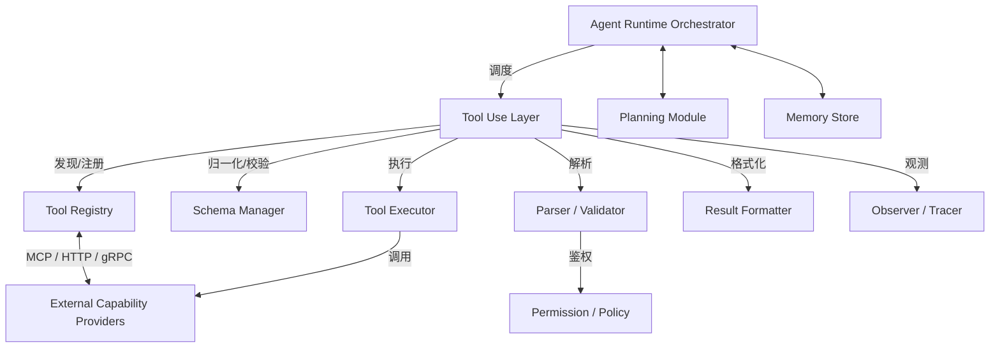

# 架构设计

Tool Use 子系统位于大模型与外部世界之间，既要理解模型的“意图”，又要保证外部调用的安全与可追溯。一个工程化的 Tool Use 层通常由七大模块组成，并与 [Agent Runtime](/05-agent/agent-runtime/)、[MCP](/05-agent/mcp/)、[Planning](/05-agent/planning/)、[Memory](/05-agent/memory/) 等主题紧密协作。

## 总体架构

## 模块职责一览

| 模块 | 核心职责 | 关键输出 |
| --- | --- | --- |
| Tool Registry | 维护可用工具的元数据，支持静态注册与动态发现 | Tool Metadata 列表 |
| Schema Manager | 归一化不同厂商的 schema 方言，执行 JSON Schema 校验 | 规范化 Schema、校验报告 |
| Parser / Validator | 把模型输出解析为内部调用对象，并做语法与语义校验 | ToolInvocation 或错误 |
| Permission / Policy | 判断当前调用是否被授权，处理敏感操作的人机确认（HITL） | 允许/拒绝/需确认 |
| Tool Executor | 真正执行工具，管理并发、超时、重试、熔断、降级 | 执行结果或异常 |
| Result Formatter | 把执行结果映射为当前厂商要求的消息格式，必要时压缩 | Message Block |
| Observer / Tracer | 记录调用链路、延迟、成功率、token 成本、schema 违规 | Span / Metric / Log |

## 控制面与数据面

Tool Use 层可以进一步拆分为控制面与数据面：

- **控制面**：负责“决策”。包括 Tool Registry 的维护、Schema Manager 的校验、Permission/Policy 的判定。控制面不触碰真实业务状态，只决定“能不能调、怎么调”。
- **数据面**：负责“执行”。包括 Parser 解析、Executor 调用外部服务、Formatter 回写结果。数据面会真正产生网络请求、读写状态，需要重点防护。

这种分离有两个好处：

1. **安全隔离**：控制面可以在受信环境中运行，数据面可以在沙箱或受限网络中运行。
2. **可扩展性**：控制面可以缓存工具元数据，数据面可以水平扩展执行 Worker。

## 与周边系统的边界

### 与 Agent Runtime 的关系
Tool Use 生成的是“调用描述”，而不是真实执行。Agent Runtime 负责把调用描述分派给实际进程、容器或服务，并管理执行生命周期。Runtime 也会把执行结果返回给 Tool Use 层进行格式化。

### 与 MCP 的关系
MCP 是外部能力的标准接入协议。Tool Registry 可以通过 MCP 的 `tools/list` 发现工具，Executor 可以通过 MCP 的 `tools/call` 发起调用。MCP 提供 schema、鉴权、传输标准化，Tool Use 负责语义层映射。

### 与 Planning 的关系
Planning 决定多步任务中工具的调用顺序与依赖关系。对于单次调用，Tool Use 独立完成；对于多步组合，Planning 把子目标交给 Tool Use 执行，并根据结果调整下一步计划。

### 与 Memory 的关系
工具调用的历史、结果、用户偏好需要回写到 Memory，供后续轮次检索。Result Formatter 在生成反馈消息时，也可以把关键信息提取成结构化记忆条目。

## 部署形态示例

在典型生产部署中，Tool Use 层可能表现为：

- **库（Library）**：与 Agent Runtime 同进程运行，适合低延迟、工具较少的场景。
- **独立服务（Service）**：通过 gRPC/HTTP 与 Runtime 通信，支持多租户、多模型、动态发现。
- **Sidecar**：与模型服务或业务服务部署在一起，负责本地工具注册与执行隔离。

选择哪种形态取决于工具数量、调用频率、安全等级和团队组织结构。下一章将详细展开一次工具调用的完整工作流。
