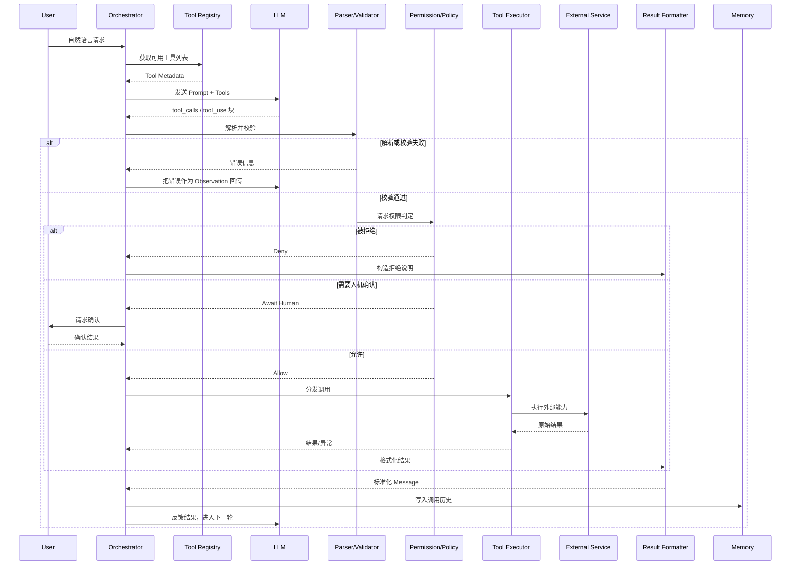
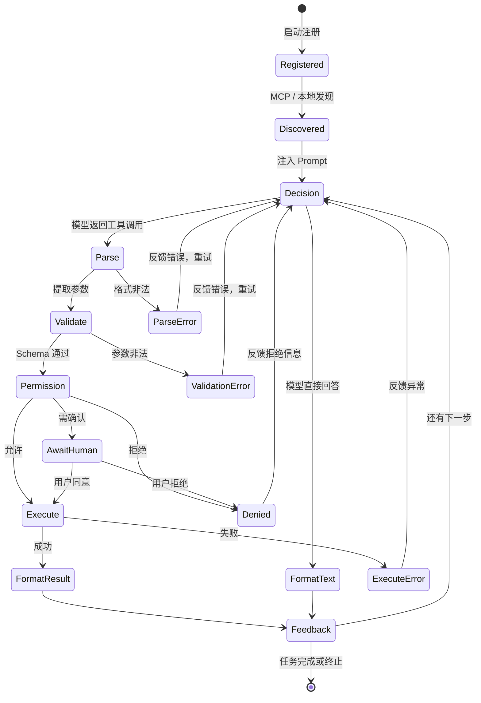

# 工具调用工作流

Tool Use 的价值最终体现在一次完整、可观测、可回滚的调用链路中。本章从端到端视角拆解这条链路，并用状态机描述其中的关键分支。

## 端到端生命周期



## 状态机视图



## 各阶段详解

### 1. Register / Discover
工具可以在编译期、启动期或运行期被发现。启动期注册适合稳定内部能力；运行期发现适合 MCP 插件生态。发现完成后，Registry 会维护一份元数据视图，供后续所有轮次使用。

### 2. Model Decision
Orchestrator 把系统提示、用户输入、可用工具描述、历史消息一起发给模型。模型输出可能是：

- 直接文本回答（无工具）。
- 一个或多个工具调用请求（并行或串行）。

### 3. Parse
Parser 把模型输出转换为内部标准结构：

```python
class ToolInvocation:
    call_id: str
    tool_name: str
    arguments: dict
```

不同厂商的输出形态不同：OpenAI 是 `tool_calls` 数组，Anthropic 是 `tool_use` 内容块，Google 是 `function_call` part。Parser 需要屏蔽这些差异。

### 4. Validate
Validator 至少执行两层校验：

- **Schema 校验**：参数是否符合 JSON Schema，必填字段是否存在，类型是否正确。
- **语义校验**：例如数值范围、业务规则、字符串白名单、时间窗口等。

如果校验失败，通常不应静默忽略，而要把错误信息返回给模型，让它有机会自我修正。

### 5. Permission / Policy
敏感操作（写数据、发邮件、扣款、删除资源）需要经过权限检查。策略可能包括：

- 基于身份的 ACL。
- 基于操作风险的动态审批。
- 基于数据敏感度的脱敏或拒绝。
- 人机确认（HITL）弹窗。

### 6. Execute
Executor 把调用分发给真实实现。这里需要考虑：

- **并发**：独立调用并行执行。
- **超时**：每个调用设置硬超时。
- **重试**：对瞬时故障进行有限重试。
- **熔断**：连续失败时快速失败，避免拖垮下游。
- **降级**：主路径失败时返回兜底结果或缓存。

### 7. Format
Formatter 把执行结果转换为模型能消费的消息格式，并进行必要处理：

- JSON 序列化。
- 超长结果截断或摘要。
- 错误信息脱敏。
- 按厂商要求包装 `tool_call_id` / `tool_use_id`。

### 8. Feedback
格式化后的消息被追加到对话历史中，模型基于新的上下文继续生成。同时，调用记录被写入 [Memory](/05-agent/memory/) 和 Observer，用于后续检索与审计。

## 终止条件

工具调用循环不会无限进行，常见终止条件包括：

- 模型不再返回工具调用，直接给出最终答案。
- 达到最大轮次限制（max turns）。
- 达到最大工具调用次数（max tool calls）。
- 用户明确终止。
- 连续多轮出现相同错误，判定为无法继续。
- [Planning](/05-agent/planning/) 模块判定任务目标已达成。

## 失败分支

| 失败类型 | 典型原因 | 处理方式 |
| --- | --- | --- |
| Parse Error | 模型输出非结构化或 JSON 非法 | 返回错误 Observation，允许模型重试 |
| Validation Error | 参数类型/必填/范围不符合 | 返回具体校验错误，模型修正 |
| Permission Denied | 当前身份无权调用 | 返回拒绝说明，必要时触发 HITL |
| Execution Error | 下游服务异常、超时、网络抖动 | 重试、熔断、降级、返回错误 |
| Malformed Result | 下游返回非预期格式 | 在 Formatter 中兜底处理 |
| Loop / No Progress | 多轮调用未推进任务 | 终止并交给用户或 Reflection 模块 |

下一章将逐一对核心模块的职责、输入输出和接口进行深入设计。
