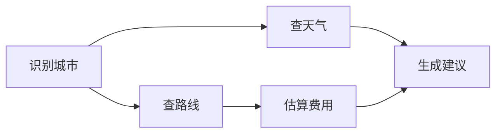

# 生产落地

Tool Use 从 Demo 走向生产，需要解决编排、版本、权限、成本、延迟、可观测性、故障处理与跨厂商兼容等一系列工程问题。本章聚焦这些落地难点。

## 多工具编排

真实任务往往需要多个工具按特定顺序或依赖关系组合执行。编排策略通常分为三种：

### 1. 单次并行（Parallel Batch）
适用于彼此独立的调用。例如同时查询多个城市的天气、同时读取多个文档。运行时并发执行，结果合并后一次性反馈给模型。

### 2. 顺序管道（Sequential Pipeline）
适用于后续调用依赖前置结果。例如：

```text
查询用户 ID → 查询订单列表 → 查询物流详情
```

这类流程由 [Planning](/05-agent/planning/) 模块生成执行计划，或由 ReAct 式循环逐步推进。

### 3. 条件 DAG（Directed Acyclic Graph）
复杂任务可以建模为 DAG：节点是工具调用，边是数据依赖。Planning 模块根据用户意图生成 DAG，Executor 按拓扑序调度。DAG 还便于失败时局部重试、并行执行无依赖节点。



## 版本管理

工具能力会迭代，schema 也会变化。生产系统需要：

- **显式版本号**：每个工具定义包含 `version` 字段，例如 `get_weather@v2`。
- **向后兼容策略**：新增可选字段通常安全；删除字段、修改类型、重命名需要发布大版本。
- **Deprecation 窗口**：旧版本保留一段时间，并在 description 中提示迁移。
- **Schema 变更检测**：CI 阶段对比新旧 schema，自动检测破坏性变更。
- **客户端适配**：不同租户或模型可能绑定不同版本，Registry 需支持按上下文路由。

## 鉴权与授权（AuthN / AuthZ）

Tool Use 连接到真实业务系统，必须解决“谁有权调什么”的问题。

- **身份认证**：通过 OAuth 2.0 / OIDC / mTLS / API Key 确认调用者身份。
- **权限范围（Scope）**：每个工具声明所需的 scope，例如 `orders:read`、`payments:write`。
- **细粒度授权**：不仅判断“能否调用工具”，还要判断“能否以该参数调用”。例如 `delete_user(user_id=123)` 需要确认当前用户有权限删除 123。
- **MCP OAuth 支持**：MCP 规范支持 OAuth 流程，客户端在发现工具前完成授权，服务端在 `tools/call` 时校验 token。
- **审计日志**：记录谁在什么时间、以什么参数调用了什么工具、结果如何，满足合规要求。

## 成本与延迟权衡

工具调用会引入额外成本与延迟，需要持续优化：

- **Prompt 长度**：每个工具定义都会占用 token。工具过多时，description 与 schema 会显著增加输入成本。
- **工具选择质量**：工具数量超过模型处理能力时，选择准确率下降。通常建议每轮可用工具控制在 8~32 个，并通过命名空间、标签、检索做动态筛选。
- **结果长度**：长结果会撑爆上下文并增加后续轮次成本。需要在 Formatter 中截断、摘要或存储到 Memory 只返回引用。
- **并行执行**：独立调用并发执行可降低端到端延迟。
- **缓存**：对幂等、低频变化的结果（如国家代码、商品目录）加缓存，减少下游调用。
- **模型选择**：简单工具调用可以使用更快、更便宜的模型；复杂推理再调用强模型。

## 结果压缩与上下文管理

工具返回结果可能非常大：

- 数据库查询返回上千行。
- 搜索召回返回多个长文档。
- API 返回完整的 JSON 对象。

常用压缩策略：

- **结构化截断**：只保留关键字段，丢弃冗余元数据。
- **LLM 摘要**：用一个小模型把长结果压缩为几句话。
- **引用模式**：把完整结果存入 [Memory](/05-agent/memory/) 或外部存储，只把摘要或引用 ID 返回给主模型。
- **分页**：让工具支持分页参数，模型按需请求下一页。

## 可观测性

工具调用链路必须可观测，否则无法定位“模型选错工具”、“参数错误”、“下游超时”等问题。

- **Trace**：使用 OpenTelemetry 把“模型调用 → 解析 → 校验 → 权限 → 执行 → 格式化”串联为一条 trace。
- **Metrics**：
  - 工具调用延迟（P50 / P95 / P99）。
  - 成功率与错误码分布。
  - Schema 违规率。
  - 工具选择错误率（可通过人工标注或 LLM Judge 评估）。
  - 重试率、降级率、熔断器状态。
  - Token 成本（输入/输出）。
- **Logging**：结构化日志记录调用参数与结果，敏感字段脱敏。
- **Alerting**：对成功率跌破阈值、P99 延迟飙升、schema 违规率升高等场景告警。

## 故障模式与缓解

| 故障模式 | 表现 | 缓解措施 |
| --- | --- | --- |
| 瞬时故障 | 下游偶发 503 / 超时 | 指数退避重试 + 抖动 |
| Schema Drift | 下游返回字段类型/结构变化 | Schema 版本管理、兼容性测试、运行时兜底 |
| 选错工具 | 模型选择了不相关工具 | 优化 description、减少每轮工具数、增加 examples |
| 参数错误 | 必填缺失、类型错误、越界 | 严格模式、语义校验、错误回显 |
| 部分批量失败 | 并行调用中部分成功部分失败 | 单独报告每个结果，让模型决定下一步 |
| 无限循环 | 多轮调用未推进任务 | max-turns、no-progress 检测、Reflection |
| 权限逃逸 | 工具参数绕过授权检查 | 参数级授权、HITL、审计 |
| 下游雪崩 | 重试流量压垮故障服务 | 熔断、限流、降级 |

## 跨厂商兼容

企业通常不会绑定单一模型厂商，Tool Use 层需要具备一定的跨厂商兼容性：

- **Schema 归一化**：内部使用统一模型，只在边界处序列化为 OpenAI / Anthropic / Google / MCP 格式。
- **调用对象归一化**：Parser 把不同厂商输出解析为内部 `ToolInvocation`。
- **结果格式归一化**：Formatter 把执行结果映射为当前厂商需要的内容块。
- **Tool Choice 语义映射**：不同厂商的控制模式不完全等价，需要在 Schema Manager 中做近似映射。
- **严格模式适配**：OpenAI strict mode 对 schema 有约束；其他厂商没有直接等价物，需在 Prompt 或后校验中补偿。

> 实践中完全无缝的跨厂商兼容很难做到，目标应是“核心逻辑一次编写，边界适配代码可测试、可替换”。

## 小结

生产级 Tool Use 不只是“让模型调用函数”，而是一套涉及编排、版本、权限、成本、可观测性与故障治理的系统工程。下一章把这些经验浓缩为可直接落地的最佳实践与反模式检查清单。
