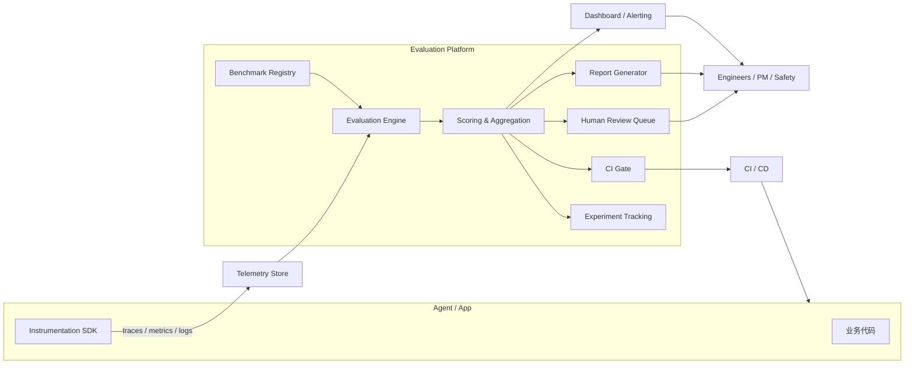

# 架构设计

一个可落地的 Benchmark + Evaluation 平台，需要把 AI 应用、可观测性、评估引擎、数据集管理、评分、告警、人工复核与 CI/CD 串联成端到端流水线。本章给出通用参考架构，并解释每个组件的职责与数据流。

## 端到端架构概览

## 各组件职责

### 1. Agent / App

被评估的对象，可以是 LLM 应用、Agent、RAG 系统或工具链。它需要：

- 暴露稳定的输入 / 输出接口，供离线评估调用。
- 内置 instrumentation，输出符合 OpenTelemetry GenAI Semantic Conventions 的 trace、metrics、logs。
- 记录足够上下文：prompt、completion、tool I/O、retrieved chunks、model 参数、latency、token 用量。

### 2. Instrumentation SDK

基于 OpenTelemetry、LangSmith、Phoenix 或自研 SDK，统一采集：

- **Traces**：LLM span、tool span、agent step span、retrieval span。
- **Metrics**：TTFT、ITL、token usage、cost、error rate、 hallucination rate。
- **Logs**：prompt、completion、exception、audit log。

设计原则：埋点标准先在组织内统一，避免每个团队各自造轮子。

### 3. Telemetry Store

可观测性后端，常见的选择包括：

- Traces：Jaeger、Tempo、Phoenix、LangSmith、Honeycomb。
- Metrics：Prometheus、VictoriaMetrics、CloudWatch。
- Logs：Loki、ELK、BigQuery、ClickHouse。

评估引擎会从 telemetry store 中读取原始 trace/log，因此 schema 需要与评估需求对齐。

### 4. Benchmark Registry

数据集与评估任务的注册中心，管理：

- 黄金数据集（输入、期望输出、标签、来源、版本）。
- 合成数据集（生成方式、生成模型、校验规则）。
- 评估任务定义（用哪个数据集、跑哪些 evaluator、阈值是什么）。
- 基线结果与历史版本对比。

需要支持版本化、权限、血缘与复现性声明。

### 5. Evaluation Engine

核心计算组件，负责：

- 离线：按 benchmark dataset 批量调用被测系统，收集输出与 trace。
- 在线：从 telemetry store 采样真实请求，异步运行 evaluator。
- 调用各类 evaluator：规则匹配、Embedding 相似度、LLM-as-judge、代码执行、外部 API。
- 处理 evaluator 的并发、重试、缓存、超时与成本。

### 6. Scoring & Aggregation

把原始 evaluator 输出转化为可理解、可对比的指标：

- 样本级分数 → 维度聚合 → 模型 / Prompt / 版本级分数。
- 分布统计：mean、P50、P90、variance、pass rate。
- 回归分析：当前版本 vs 基线的差异、显著性、p-value。
- 失败模式聚类：按错误类型、输入主题、工具类型分组。

### 7. Experiment Tracking

记录每次评估的元数据，便于横向对比：

- 模型版本、Prompt 版本、工具版本、检索索引版本。
- 评估数据集版本、evaluator 版本、judge 模型版本。
- 超参数：temperature、top_p、max_tokens。
- 结果曲线、样本明细、失败案例。

常用工具：MLflow、Weights & Biases、LangSmith、Phoenix。

### 8. CI Gate

把评估结果接入 CI/CD：

- PR 阶段跑离线评估，阻止 regression。
- 发布阶段跑完整 benchmark，生成发布报告。
- 配置阈值：总体分数下降超过 x% 即失败；特定能力集（如安全、数学）必须全过。

CI Gate 需要快速反馈，因此离线评估必须控制在合理耗时内。

### 9. Human Review Queue

对以下样本推送给人工复核：

- 自动评估置信度低。
- 涉及安全、合规、高商业风险。
- 新出现的失败模式。
- 用户投诉或差评。

复核结果用于：更新黄金数据集、校准 judge、触发 incident。

### 10. Report Generator / Dashboard / Alerting

- **Dashboard**：按能力、模型、版本、时间维度展示质量、成本、延迟趋势。
- **Alerting**：当关键指标突破 SLO 或发生回归时通知团队。
- **Report Generator**：生成模型选型报告、发布验收报告、安全审计报告。

### 11. Feedback to CI/CD

评估结果最终反馈给：

- 模型选择：是否切换主模型、启用 fallback。
- Prompt 优化：针对失败模式改写 Prompt。
- 工具链：修复工具描述、增加参数校验、调整工具集。
- Guardrails：收紧安全策略、增加输入 / 输出过滤。
- 部署策略：回滚、灰度、A/B 测试。

## 关键设计权衡

| 权衡 | 选项 A | 选项 B | 建议 |
|---|---|---|---|
| 评估时机 | 离线批量 | 在线实时 | 离线做门控，在线做监控，影子评估做回归 |
| Judge 成本 | 轻量规则 / embedding | 强 LLM judge | 先规则过滤，高价值样本再上 LLM judge |
| 数据真实性 | 黄金数据 | 合成数据 | 核心能力用黄金，长尾覆盖用合成 |
| 评估粒度 | 端到端 | 单步 / 单模块 | 端到端定方向，模块级定位根因 |
| 反馈速度 | 快速近似评估 | 慢速精确评估 | CI 要快，人工复核要准 |

## 小结

Benchmark + Evaluation 平台不是孤立工具，而是贯穿 Agent / App → 埋点 → 可观测后端 → 评估引擎 → 评分 → 告警 / 人工复核 → CI/CD 的闭环系统。架构设计的核心是让"评估"成为与"开发"、"部署"、"运维"同等级别的工程活动。下一章将展开评估工作的完整生命周期。
