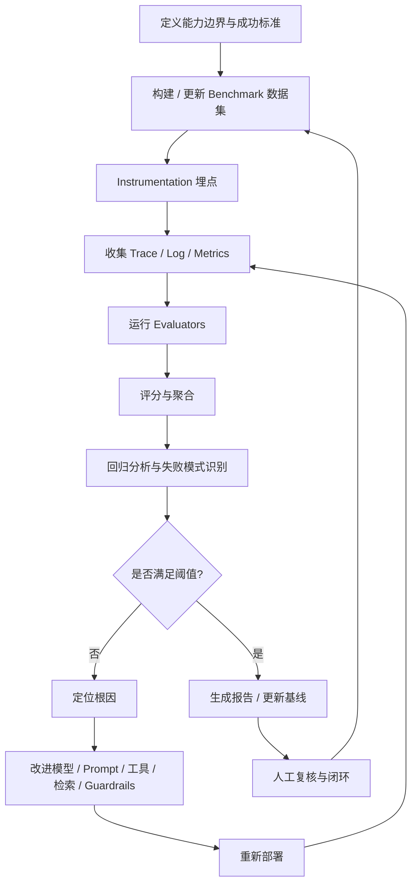

# 评估工作流程

评估工作不是"跑一个脚本看分数"，而是一个持续迭代的工程生命周期。本章给出从能力定义到重新部署的完整流程，并用 Mermaid 流程图展示关键环节。

## 生命周期概览

## 步骤详解

### 1. 定义能力边界与成功标准

在动手写评估之前，先回答三个问题：

- **系统应该做什么？** 例如：回答产品咨询、生成代码、调用工具完成订票、辅助医学问答。
- **什么算"对"？** 把"对"拆解为可评估的维度：正确性、事实性、工具使用、安全、延迟、成本。
- **可接受的底线是什么？** 例如：幻觉率 < 2%、工具调用成功率 > 95%、P95 TTFT < 500ms、单会话成本 < $0.05。

这些标准应来自产品、安全、法务、运维多方共识，并写入 SLO / Error Budget。

### 2. 构建 / 更新 Benchmark 数据集

数据集是评估的"测试用例库"。构建时遵循以下原则：

- **覆盖核心能力**：每个能力至少有一个数据集。
- **覆盖失败模式**：包含已知容易出错的输入（边界、歧义、对抗）。
- **真实分布优先**：优先使用脱敏后的真实用户请求，必要时补充合成数据。
- **标注质量**：明确标注规范，双人标注 + 仲裁机制。
- **版本管理**：数据集是代码，使用 DVC / LakeFS / 对象存储版本化。

数据集应包含：

| 字段 | 说明 |
|---|---|
| `input` | 用户输入或上下文 |
| `expected` | 期望输出、参考答案或验收标准 |
| `tags` | 能力标签、失败模式标签、难度等级 |
| `metadata` | 来源、创建时间、标注人、版本 |
| `evaluator_hint` | 该用例推荐的 evaluator 或特殊判断规则 |

### 3. Instrumentation 埋点

评估依赖高质量的可观测性数据。埋点时需要记录：

- 每次 LLM 调用的输入、输出、模型、参数、token、延迟。
- 每次工具调用的名称、参数、返回值、耗时、错误。
- 每次检索的 query、召回片段、相关性分数。
- Agent 步骤之间的因果关系与状态变更。

埋点规范建议采用 OpenTelemetry GenAI Semantic Conventions，确保跨框架一致。

### 4. 收集 Trace / Log / Metrics

- **离线评估**：直接调用被测系统，同步收集输出与 trace。
- **在线评估**：从生产或影子流量中采样，异步写入 Telemetry Store，再由评估引擎拉取。
- **影子评估（Shadow Evaluation）**：新版本与旧版本同时接收生产流量，但新版本不返回给用户，仅用于对比评估。这是最安全的新版本回归检测方式。

### 5. 运行 Evaluators

Evaluator 是具体打分逻辑。常见类型：

| Evaluator 类型 | 适用场景 |
|---|---|
| 规则匹配 | 输出必须包含 / 不包含某些关键字、JSON Schema 校验 |
| Embedding 相似度 | 语义相似、释义匹配 |
| LLM-as-judge | 开放性答案、多维质量评分、安全判断 |
| 代码执行 | 代码生成任务（如 HumanEval） |
| 外部工具 / API | 需要调用搜索引擎、数据库验证事实 |
| 人工评估 | 主观质量、安全边界、复杂推理 |

运行时需要考虑并发、缓存（避免重复调用 judge）、超时、失败降级。

### 6. 评分与聚合

把 evaluator 结果汇总为不同层级的指标：

- **样本级**：每条输入的分数与失败原因。
- **能力级**：按标签聚合（如"数学推理"平均 87 分）。
- **版本级**：当前 Prompt 版本 vs 上一版本的全局对比。
- **时间级**：趋势曲线，观察是否随时间漂移。

聚合时要给出置信区间或统计显著性，避免被小样本波动误导。

### 7. 回归分析与失败模式识别

当新版本分数下降时，需要定位：

- 是全局下降还是特定能力下降？
- 是特定输入类型（长文本、多语言、代码）导致的吗？
- 是模型问题、Prompt 问题、工具问题还是检索问题？
- 是否与成本 / 延迟变化相关？

常用手段：

- Diff 视图：同一数据集上两个版本的样本级对比。
- 失败聚类：按错误类型、输入主题、输出模式聚类。
- Trace 回放：复现失败样本的完整 Agent 执行路径。

### 8. 决策与反馈

如果通过阈值，更新基线并发布报告；如果未通过，进入根因修复循环：

- **模型**：换模型、微调、量化、蒸馏。
- **Prompt**：增加示例、明确约束、分解任务。
- **工具**：修复工具描述、增加参数校验、补充工具示例。
- **检索**：调整 chunk 策略、重排序、扩充知识库。
- **Guardrails**：增加输入过滤、输出校验、安全拦截。

### 9. 人工复核与闭环

自动评估无法覆盖所有情况。建立人工复核机制：

- 每周抽检低置信度样本。
- 每月评估 judge 模型与人工评分的一致性。
- 将新发现的失败模式补充进 benchmark 数据集。
- 把人工标注结果回流，训练或校准自动 evaluator。

## 小结

评估工作流是一个从"定义标准"到"收集数据"、"运行评估"、"分析回归"、"修复迭代"、"重新部署"的闭环。只有把每个步骤标准化、工具化、版本化，评估才能成为持续可靠的工程实践。下一章将拆解流程中的核心模块。
