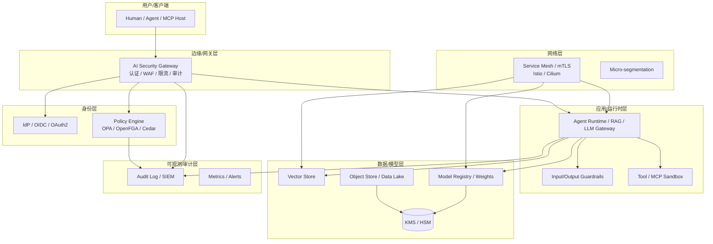

# 架构设计

AI 安全架构需要把“身份、网络、应用、数据、模型、可观测”六个层面的控制串成一条可验证的链。任何一层出现短板，都可能让上层控制失效。

## 分层安全架构

### 1. 边缘/网关层

这是外部流量进入系统的第一道关卡，承担：

- **认证**：API Key、OIDC、OAuth2、mTLS。
- **流量控制**：rate limit、DDoS 防护、bot 管理。
- **初步审计**：记录请求元数据。
- **密钥隔离**：LLM provider key 与 tenant key 分离，避免泄露。

### 2. 身份与策略层

- **Identity Provider（IdP）**：管理人类与机器身份，支持 SSO、MFA、会话管理。
- **Policy Engine**：把认证信息转化为授权决策。
  - **RBAC**：角色-权限映射，适合静态组织结构。
  - **ABAC**：基于属性（部门、数据分类、时间、位置）动态决策。
  - **ReBAC**：基于关系（用户-文档-项目）决策，适合复杂协作场景。
  - 代表项目：OPA（通用策略）、OpenFGA（ReBAC）、Cedar（AWS 开源授权语言）。

### 3. 网络层

- **mTLS**：服务间双向 TLS 认证，防止伪造。
- **Service Mesh**：Istio、Linkerd、Cilium 提供 L4/L7 策略、可观测、流量加密。
- **Micro-segmentation**：把训练、推理、向量库、数据湖划分到不同安全域，限制横向移动。
- **Egress 控制**：限制推理服务只能访问允许的模型 API 与外部服务。

### 4. 应用/运行时层

- **Agent Runtime**：执行 ReAct 循环，需要工具 capability 校验、调用沙箱、超时/步数限制。
- **Guardrails**：输入过滤（提示注入、越狱）、输出过滤（有害内容、PII、代码安全）。
- **Tool / MCP Sandbox**：工具调用在受限环境中执行，避免 SSRF、命令注入、数据外泄。

### 5. 数据/模型层

- **Vector Store**：多租户索引隔离、字段级加密、访问审计。
- **Model Registry**：模型版本签名、来源追溯、访问控制。
- **Object Store / Data Lake**：训练数据分类、去标识化、保留策略。
- **KMS / HSM**：加密静态与传输中的密钥、模型权重、Embedding。

### 6. 可观测/审计层

- **Audit Log**：append-only，记录身份、动作、资源、决策、原因。
- **SIEM/SOAR**：聚合日志、检测异常、自动化响应。
- **Metrics/Alerts**：监控异常调用模式、密钥使用、Guardrail 拦截率。

## 控制面与数据面

| 平面 | 职责 | 典型组件 |
|---|---|---|
| 控制面 | 身份、策略、配置、密钥分发、模型版本管理 | IdP、OPA、Vault、K8s API、Model Registry |
| 数据面 | 实际请求处理、模型推理、工具调用、数据读写 | LLM Gateway、Agent Runtime、Vector Store、工具沙箱 |

**关键原则**：控制面的高权限必须被严格保护；数据面应尽量无状态、不可直接访问密钥仓库。

## 边界安全 vs 零信任

| 模式 | 假设 | 适用场景 |
|---|---|---|
| 边界安全 | 内网可信，重点防御外部 | 传统单体、封闭式训练集群 |
| 零信任 | 内外部均不可信，每次验证 | 多租户 SaaS、分布式 Agent、外部模型 API |

AI 系统通常同时需要两者：对外服务使用零信任，对封闭训练环境保留物理/网络边界。

## 小结

AI 安全架构通过六层控制把“身份、网络、应用、数据、模型、审计”连成闭环。下一章将把这些层次映射到 AI 系统从设计到退役的全生命周期中。
