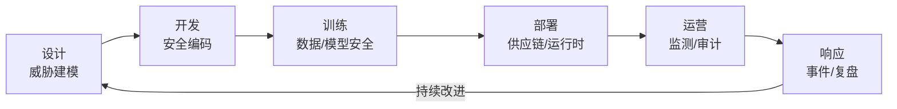

# AI 安全生命周期

安全不是一次性扫描，而是贯穿 AI 系统全生命周期的持续过程。借鉴 SDL（Security Development Lifecycle）和 MLSecOps，我们把 AI 系统安全划分为六个阶段。

## 1. 设计阶段：威胁建模与风险定级

- **业务场景分析**：系统处理什么数据？做什么决策？影响哪些用户？
- **威胁建模**：使用 STRIDE、OWASP LLM Top 10、NIST AI RMF 识别威胁。
- **风险分级**：
  - 高风险：医疗诊断、信贷审批、自动驾驶、招聘筛选。
  - 中风险：客服、内容生成、代码辅助。
  - 低风险：内部知识问答、非敏感数据分析。
- **合规预评估**：GDPR、AI Act、SOC2 等适用条款提前确认。

## 2. 开发阶段：安全编码与数据治理

- **依赖管理**：定期扫描 Python/Node/Java 依赖漏洞，锁定版本。
- **密钥管理**：禁止硬编码 API Key，使用 Vault/Secret Manager，配合 pre-commit hook 扫描。
- **Prompt 工程审计**：系统提示模板需经安全 review，避免泄露敏感指令。
- **数据清洗与去标识化**：训练数据去除 PII、毒性内容、版权风险数据。
- **代码审查**：重点检查工具调用、文件访问、网络请求、反序列化点。

## 3. 训练阶段：模型安全与可复现

- **数据血缘**：记录训练数据来源、版本、清洗规则（DVC、MLflow）。
- **投毒/后门检测**：监控异常标签、异常样本分布。
- **安全对齐**：RLHF、Constitutional AI、DPO 降低有害输出。
- **模型版本与签名**：使用 Safetensors、Sigstore cosign 对模型文件签名。
- **实验环境隔离**：训练集群与生产网络隔离，限制外部 egress。

## 4. 部署阶段：供应链与运行时基线

- **镜像安全**：最小基础镜像、无 root、只读文件系统、定期扫描。
- **配置安全**：避免默认值、关闭调试接口、启用 TLS。
- **模型来源验证**：部署前校验模型签名与 provenance（SLSA）。
- **网络策略**：K8s NetworkPolicy、Istio AuthorizationPolicy、egress 白名单。
- **密钥注入**：通过 Vault Agent、external-secrets、CSI driver 注入，避免落盘。

## 5. 运营阶段：监测、审计与持续评估

- **实时 Guardrails**：输入/输出过滤、 toxicity 检测、PII 检测。
- **行为基线**：监控异常调用量、异常 token 消耗、异常工具调用序列。
- **审计日志**：所有认证、授权、Guardrail 决策、人工审批留痕。
- **红队与对抗测试**：定期模拟提示注入、越狱、数据外泄攻击。
- **模型漂移与毒性监测**：监控输出分布变化、用户举报、自动化安全评估。

## 6. 响应阶段：事件响应与恢复

- **事件分类**：数据泄露、模型被窃、有害内容大量生成、密钥泄露、供应链投毒。
- **响应 playbook**：隔离、撤销凭证、回滚模型/配置、通知利益相关方、上报监管。
- **根因分析**：结合 trace、audit log、模型版本、Prompt 版本定位问题。
- **事后复盘（Postmortem）**：更新控制、策略、工具与培训。

## 安全生命周期流程图

## 与 DevSecOps / MLSecOps 的关系

- **DevSecOps**：把安全测试、扫描、策略校验集成到 CI/CD。
- **MLSecOps**：把模型扫描、数据验证、实验审计、模型签名纳入 MLOps pipeline。

两者共同目标是：**让安全成为自动化、可重复、可度量的工程实践**。

## 小结

AI 安全生命周期把“设计 → 开发 → 训练 → 部署 → 运营 → 响应”串成闭环。下一章将拆解每个阶段所需的核心模块与工具。
