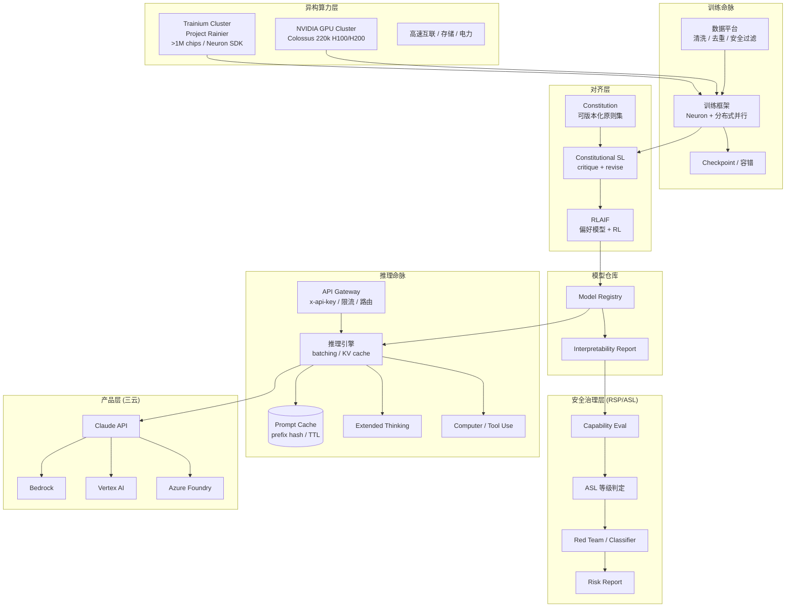

# 架构设计

Anthropic 的基础设施可以用"两条命脉 + 一个治理层"来概括：**训练/算力命脉**负责生产模型，**推理/产品命脉**负责把模型变成在线服务，**安全治理层（RSP/ASL）**贯穿两者，决定什么能训、什么能发。三者共享模型仓库与可解释性工具链。

## 总体架构

## 异构算力层

Anthropic 的算力层是整个案例中最具特色的部分——它主动选择了"两条腿走路"：

### Trainium 主力（AWS）

- **Project Rainier**：与 AWS 合作的专用超算集群，目前使用 **>100 万 Trainium2 芯片**，是"世界上最大的计算集群之一"。
- **规模承诺**：未来 10 年向 AWS 投入超 **$100B**，最高 **5GW** 电力，覆盖 Trainium2 → Trainium3 → Trainium4，以及 Graviton CPU。
- **节奏**：Trainium2 于 2026 上半年放量，到 2026 年底 Trainium2 + Trainium3 合计接近 1GW。
- **软件栈**：AWS Neuron SDK（编译、运行时、分布式训练），与 PyTorch 集成。

### NVIDIA GPU 补充（Colossus）

- **Colossus**：通过 SpaceXAI 合作租用的 **22 万 GPU 集群**（H100/H200，计划引入 Blackwell GB200），用于训练未来 Claude 模型的峰值算力补充。
- **意义**：芯片多元化降低单一供应链风险，也提升与供应商的议价能力。

### 网络与存储

- 高带宽节点内互联（Trainium 节点内高速链路 / NVLink 等）+ 集群间高速网络。
- 高吞吐并行文件系统支撑 TB 级 checkpoint。
- 电力与散热是 5GW 规模下的核心约束——Anthropic 甚至在 Colossus 合作中探讨了"轨道算力"的远期设想。

## 对齐层

对齐层把"宪法"作为一等公民的工程输入：

- **Constitution（宪法）**：一组可版本化、可追溯来源（联合国人权宣言、平台服务条款等）的原则集合。
- **Constitutional SL**：critique-revise 循环，生成修订后的监督数据。
- **RLAIF**：用宪法驱动的 AI 偏好替代人类偏好，训练偏好模型，再做 RL。

> 详见 [训练与推理流水线](04-training-and-inference) 的对齐小节。

## 推理命脉

### 接入层

- **认证**：`x-api-key` 头、organization / workspace 隔离（prompt caching 已从 org 级迁移到 workspace 级隔离）。
- **限流**：按 tier、模型、token budget、并发；cache 命中不计入限流额度。
- **三云入口**：Claude API、Bedrock、Vertex AI、Azure Foundry——同一模型多云托管。

### 推理引擎层

- **Continuous Batching / In-flight Batching**：提高芯片利用率、降低平均延迟。
- **KV Cache 管理**：分页式管理、长上下文。
- **Prompt Caching**：产品级 prefix cache（prefix hash + 20-block lookback + 5m/1h TTL），是 Anthropic 最具辨识度的推理工程。
- **Extended Thinking**：测试时计算（thinking budget），并在 Opus 4.5+/Sonnet 4.6+ 上默认保留 thinking block 以利于缓存复用。
- **Computer Use / Tool Use**：智能体能力的执行后端，需要沙箱、权限与长程状态管理。

## 安全治理层（RSP / ASL）

治理层是"什么能训/什么能发"的控制平面：

- **Capability Eval**：在训练前后评估模型是否触及 CBRN、网络、说服、自主性等能力阈值。
- **ASL 判定**：根据评估结果判定当前应满足的 AI Safety Level（1~5）。
- **防护执行**：ASL-3 对应输入/输出分类器、加强的权重安全等；ASL-2 为常规 moderation。
- **Risk Reports**：每 3–6 个月发布，含能力、威胁模型、缓解措施与残余风险，必要时由第三方专家审查。

> 详见 [核心模块](05-core-modules) 与 [企业生产实践](08-production-practice)。

## 数据面与控制面

| 平面 | 职责 | 典型系统 |
|---|---|---|
| 数据面 | 训练/推理流量、模型权重、KV cache、prompt cache | Trainium/GPU 集群、推理服务器、缓存服务 |
| 控制面 | 任务调度、模型版本、宪法版本、ASL 判定、策略、审计 | Kubernetes、Model Registry、Constitution Store、ASL Policy Engine |

## 与云厂商的关系

Anthropic 自身聚焦模型与平台，把底层算力与全球分发交给云：

- **AWS**：主力训练与云提供商，Trainium 集群 + Bedrock + Claude Platform on AWS（同账户、同控制、同计费）。
- **Google Cloud**：Vertex AI 托管 Claude，Org 级 cache 隔离。
- **Microsoft Azure**：Azure Foundry 托管 Claude。
- **SpaceXAI**：Colossus 算力租约（非托管，算力供给）。

Claude 因此成为"唯一在三朵最大云上都可用的前沿模型"。

## 小结

Anthropic 的架构 = **异构算力（Trainium + GPU）+ 宪法对齐层 + 推理优化（prompt caching / extended thinking）+ RSP/ASL 治理层**，在"三云"上承载同一套 Claude 能力。下一章拆解训练与推理两条流水线的具体环节。
