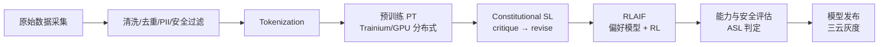
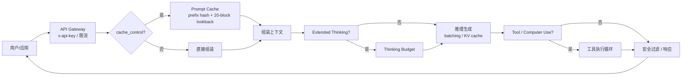

# 训练与推理流水线

Anthropic 把 Claude 从"数据"变成"线上服务"的过程，可以拆成两条流水线：**训练流水线**（含宪法对齐），**推理流水线**（含 prompt caching 与 extended thinking）。两者通过模型仓库与 ASL 门禁衔接。

## 训练流水线（含宪法对齐）

### 1. 数据采集与清洗

- **来源**：公开网页、代码、授权数据、合成数据；为对齐与安全评估专门生成高质量合成样本。
- **清洗**：去重、质量评分、毒性/安全过滤、PII 处理、语言识别。
- **可解释性友好**：部分数据集设计便于后续用 dictionary learning 分析模型行为。

### 2. Tokenization

- BPE 及其变体；词表大小影响压缩率与多语言/代码表现。

### 3. 预训练（PT）

- **异构执行**：主力 Trainium2（Neuron SDK），峰值由 Colossus GPU 补充；训练框架需同时高效支持两套硬件。
- **分布式并行**：数据 / 张量 / 流水线 / 专家（MoE）并行，配合高速互联与 all-reduce / all-to-all 通信。
- **混合精度**：低精度训练降低算力与带宽消耗。
- **Checkpoint / 容错**：在 5GW 规模下，硬件故障是常态，高频 checkpoint 与快速恢复是训练效率的命脉。

### 4. Constitutional SL（监督阶段）

这是 Anthropic 对齐流程的第一阶段，区别于纯人类标注的 SFT：

1. 给定用户请求，模型生成 **初始回答**。
2. 用一条宪法原则，提示模型对自己回答做 **critique（批评）**（例："这个回答是否暗示了不准确的信息？请指出"）。
3. 基于 critique 生成 **revised（修订）** 回答。
4. 多轮、多原则后，收集 (请求, 修订回答) 对作为监督数据微调模型。

> 工程意义：把"人类写答案"换成"模型按宪法改答案"，可大规模、可复现、可随宪法版本演进。

### 5. RLAIF（强化学习阶段）

第二阶段用 AI 反馈替代人类偏好标注：

1. 对同一请求生成两个回答 A、B。
2. 提示模型按宪法原则判断哪个更好（"哪个更诚实/无害/有用"），得到 **AI 偏好标签**。
3. 用这些偏好训练 **偏好模型（Preference Model, PM）**。
4. 用 PM 作为奖励信号，对策略做 RL（早期 CAI 论文用 PPO；后续生态亦探索 DPO 类方法）。

> 与 RLHF 的本质区别：偏好标签来自"对照宪法的 AI 判断"，而非人类逐对标注。人类的工作是"写宪法"，不是"打标签"。

### 6. 能力与安全评估（ASL 门禁）

- 运行 RSP 要求的评估：CBRN、网络安全、说服、模型自主性等。
- 判定模型应满足的 ASL 等级；未达对应防护则不能上线、甚至不能开始下一代训练。
- 红队（内部 + 外部）与分类器（输入/输出）验证。

### 7. 模型发布

- 生成 Model Card / System Card 风格的安全与能力报告。
- 三云灰度：先 API，再 Bedrock / Vertex / Foundry；按 tier、区域、流量比例放量。
- 版本化命名（`claude-opus-4-8`、`claude-sonnet-5` 等），支持回滚。

## 推理流水线

### 1. 请求接入

- 认证：`x-api-key`、organization、workspace。
- 限流：按 tier/模型/token/并发；**cache 命中不计入限流额度**，激励开发者复用前缀。
- 路由：按模型、区域容量、延迟选择推理集群。

### 2. Prompt Caching（前缀复用）

Anthropic 推理最具辨识度的工程：

- **缓存层级**：按 `tools → system → messages` 顺序构建前缀。
- **断点机制**：自动缓存（顶层 `cache_control`，自动落在最后一个可缓存块）或显式断点（在单个 block 上标 `cache_control`，最多 4 个）。
- **命中判定**：在断点处计算 prefix hash，向前回看最多 **20 个 block**，寻找之前写过的匹配条目。
- **TTL**：默认 5 分钟，可选 1 小时（成本为 base input 的 2 倍）。
- **成本**：5m 写入 = base ×1.25；1h 写入 = base ×2；读 = base ×0.1。
- **隔离**：组织间隔离；Claude API / Foundry 上进一步做到 **workspace 级隔离**（2026-02 起）。
- **预热**：用 `max_tokens=0` 提前写入 system/tools 缓存，消除首次 TTFT 惩罚。
- **计费可见**：响应 `usage` 含 `cache_creation_input_tokens` / `cache_read_input_tokens` / `input_tokens`。

### 3. 推理执行

- Continuous batching 提高吞吐；KV cache 分页管理支撑长上下文。
- 自回归生成，遇 stop 或达 `max_tokens` 停止；streaming 逐 token 推送。
- **Extended Thinking**：分配 thinking budget 做测试时计算；thinking block 在 Opus 4.5+/Sonnet 4.6+ 默认保留并可被缓存复用。

### 4. Tool / Computer Use（智能体）

- 解析 `tool_use` / `tool_result`，按 schema 校验并执行（通常在沙箱内）。
- computer use 需要屏幕/鼠标/键盘动作的执行后端与权限边界。
- 多步工具调用构成 Agent 循环，每步都可受益于 prompt caching。

### 5. 后处理与安全

- 输出经 ASL 对应的 moderation 分类器（ASL-3 更严）。
- 格式化（structured outputs、tool call）。
- 记录 usage、计费、审计；安全相关交互留痕供 Risk Report 使用。

## 训练与推理的协同

| 方面 | 训练（含对齐） | 推理 |
|---|---|---|
| 目标 | 高吞吐、高利用率、容错、对齐可重复 | 低延迟、高可用、低成本 |
| 主要资源 | Trainium/GPU 计算 + 网络 + 存储 | 芯片计算 + KV cache + prompt cache |
| 关键工程 | 异构并行、checkpoint、Constitutional SL/RLAIF | batching、prompt caching、extended thinking |
| 治理约束 | ASL 门禁、宪法版本、能力评估 | ASL 防护、分类器、限流、审计 |
| 故障影响 | 损失训练时间（极昂贵） | 影响用户体验/收入 |

## 小结

Anthropic 的训练流水线把 **Constitutional AI（SL + RLAIF）** 嵌入预训练之后，把 **ASL 门禁** 嵌入发布之前；推理流水线把 **prompt caching** 与 **extended thinking** 嵌入每一次请求。两者共同构成了"对齐驱动 + 成本可控"的完整闭环。下一章拆解支撑这两条流水线的核心模块。
