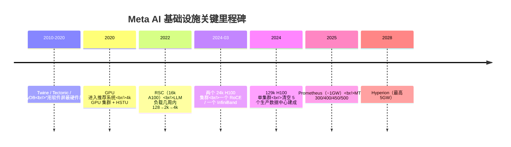

# 1. 背景：为什么研究 Meta

Meta（Facebook 母公司）的 AI 基础设施故事，是理解"开放生态如何 scale 到极致"的最佳样本。它不像 OpenAI 那样把模型与基础设施都藏在 API 之后，也不像 Anthropic 那样把安全治理做成闭源合规框架——Meta 同时在做三件外部可见的事：**训练前沿模型（Llama 系列）、自研与协同设计硬件（Grand Teton / Catalina / MTIA）、把整套栈以开放标准贡献给行业（OCP / PyTorch / Llama Stack）**。

本章先回答三个问题：Meta 的基础设施是怎么一步步走到 GenAI 规模的？为什么"同步训练"会彻底改变可靠性模型？以及它未来 5 年的规模路线是什么。

## 1.1 基础设施的二十年演进

Meta 把自己的基础设施演进划分为几个清晰的阶段（见官方 2025-09-29 文章《Meta's Infrastructure Evolution and the Advent of AI》）。

### 第一阶段（2004–2010）：LAMP 与缓存一致性

早期的 Facebook 跑在经典的 **LAMP 栈**（Linux + Apache + MySQL + PHP）上。真正让它能 scale 的，是围绕这套栈构建的缓存与一致性基础设施：

- **Memcache / TAO**：把社交图谱（social graph）与热数据放进内存，用缓存一致性协议（lease、read-your-writes）应对"点赞→好友看到"这类低延迟读写。
- **Edge / CDN 基础设施**：把照片与静态资源推到全球边缘节点。
- **自有光纤骨干**：连接 Prineville、Forest City 等第一批自建数据中心。

这一阶段的核心工程信条是：**硬件不可靠没关系，软件来兜底**——某台机器挂了，重试到另一台即可。这套思路在后面会与 AI 工作负载发生剧烈冲突。

### 第二阶段（2010–2020）：集群管理与"屏蔽故障"

随着服务规模从百万级机器膨胀，Meta 构建了一整套"把故障屏蔽掉"的分布式系统底座：

| 系统 | 作用 |
|---|---|
| **Twine** | 集群管理器（cluster manager），把"几十万到上百万台机器"抽象成可调度资源池。 |
| **Tectonic** | 数据中心级分布式文件系统（DC-scale DFS），针对 Flash 介质优化，支撑 EB 级存储。 |
| **ZippyDB** | 强一致键值存储（基于 Paxos 复制）。 |
| **Shard Manager** | 分片与放置管理。 |
| **Delos** | 一致性控制面。 |
| **Service Router** | 服务网格（service mesh）。 |
| **Kraken** | 配置/部署系统。 |
| **Taiji** | 流量负载均衡。 |
| **Maelstrom** | 数据中心级灾难容灾（把整个数据中心当故障域演练）。 |

这套系统的设计目标，是用软件把"廉价、不可靠、会挂的硬件"变成"对外高可用的服务"。这个阶段最重要的遗产是 **Twine**——它后来成为 GenAI 集群管理的底座。

### 第三阶段（2020–2022）：GPU 进入推荐系统

转折点发生在 2020 年前后。短视频（Reels）和内容推荐让**深度学习推荐模型（DLRM）**成为核心负载，Meta 第一次大规模部署 GPU 集群——最初的 **4k GPU 集群**就是为 ranking/recommendation 模型建的，而不是 LLM。

这一阶段的关键创新是 **HSTU（Hierarchical Sequential Transduction Units）**，它把生成式推荐（Generative Recommenders）的训练与推理加速了 **10–1000 倍**，奠定了"用 GPU 做大规模嵌入与序列建模"的工程基础。

### 第四阶段（2022–至今）：LLM 与同步训练

2022 年 LLM 兴起后，Meta 发现训练负载的规模在**几周内**从 128 个 GPU 跳到 2k、再到 4k——这不是线性增长，而是工作负载形态的根本变化。这直接催生了 GenAI 基础设施的第二波投资，也是本案例的核心。

## 1.2 为什么同步训练改变了可靠性模型

理解 Meta 基础设施工程的关键，是理解 **同步训练（synchronous training）** 的本质。前两个阶段的所有系统（Twine、Tectonic、Memcache）都建立在"一台机器挂了，重试到另一台"的假设上。但分布式数据并行训练打破了这个假设。

在一个数据并行（DP）任务里，每个 step 的反向传播结束后，所有 rank 必须做一次 **AllReduce / AllGather** 来同步梯度或参数：

- 只要**一个 rank** 慢了（straggler），整个集群就要等它——这就是 **straggler 问题**。
- 只要**一个 rank** 挂了（GPU/HBM/网络故障），整个同步组就会卡在 collective 上——整个任务必须停顿、重启。

这意味着：

> **一个 N-GPU 同步训练任务的可靠性 ≈ 单 GPU 可靠性的 N 次方。** 集群越大，整体越脆弱——除非工程上把单点故障率压到极低、并把恢复做到极快。

这就是为什么 Meta 投入巨资做 SDC 检测、auto-restart、checkpoint 优化——不是"锦上添花"，而是"同步训练能跑下去"的**前提条件**。官方数据：Llama 3 训练中 **>66% 的中断来自硬件**（SRAM、HBM、processing grid、网络交换机），Meta 通过行业协作把中断率降低了约 **50 倍**，把有效训练时间（effective training time）推到 **>95%**，在 16k GPU 上实现 **>400 TFLOPS/GPU** 的算力利用率。

## 1.3 规模路线：从 24k 到 5GW

Meta 的 GenAI 集群规模演进本身就是一份路线图：

| 时间 | 集群 | 规模 | 备注 |
|---|---|---|---|
| 2022 | RSC（Research SuperCluster） | 16k A100 | 早期 LLM 研究集群。 |
| 2024-03 | 两个 GenAI 集群 | 各 24,576 H100 | 一个 RoCE、一个 InfiniBand；Llama 3 在 RoCE 集群上训练。 |
| 2024 | 单体超集群 | 129k H100 | 清空 5 个生产数据中心、数月内建成。 |
| 2025 | Prometheus | ~1 GW | 跨多栋建筑 + 防风雨帐篷 + 托管（colocation）；Twine + MAST 支撑长距离地理分布式训练。 |
| 2028 | Hyperion | 最高 5 GW | 下一个量级的超级集群。 |

与之配套的是硬件组合：

- **NVIDIA**：H100（2024 集群主力）、Blackwell GB200（Catalina 机柜）、GB300（规划中）。
- **AMD**：MI300。
- **自研 MTIA**：300（ranking/recommendation 训练）、400/450/500（推理为主，cadence ~6 个月/代），与 Broadcom 合作。

## 1.4 开放生态哲学

Meta 与其他前沿实验室最根本的区别，是它**主动把基础设施变成开放标准**：

- **OCP（Open Compute Project）**：Meta 是 OCP 创始成员之一，贡献了约 187 项（占比 ~25%）的硬件规范，包括 Grand Teton、Catalina、Open Rack。
- **PyTorch**：Meta 是主要贡献者，PyTorch 已成为 LLM 训练事实标准。
- **Triton**：GPU kernel 语言与编译器，已被行业广泛采用。
- **Llama 开放权重**：Llama 3（8B/70B/400B）、Llama 4（Scout/Maverick/Behemoth）以开放权重发布，可在所有主流云与硬件上部署。
- **Llama Stack**：把 Inference、Safety、Agent、Eval 等 9 类 API 标准化为开放接口。
- **安全工具开放**：Llama Guard、Prompt Guard、CyberSecEval、Code Shield 全部开源。

这套哲学的深层逻辑是：**开放让"硬件工程师有标准 workload 可优化"**。当你把 Grand Teton 的设计、PyTorch 的接口、Llama 的权重都公开，整个供应链（NVIDIA、AMD、Broadcom、云厂商）都能围绕同一套标准做优化——开放本身成为规模化的杠杆。

## 小结

Meta 的基础设施背景可以浓缩为一句话：**它用二十年把"用软件屏蔽故障"做到极致，又在 LLM 时代被迫重新学习"如何让同步训练在大规模上可靠地跑下去"，并把这一切以开放标准的形式贡献给行业**。后续章节将沿着这条主线，拆解架构、训练、可靠性、自研硅与开放发布的每一个工程细节。
