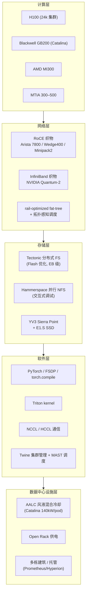

# 3. 架构设计

本章从**全局分层**视角拆解 Meta 的 GenAI 集群架构。一个 Meta 训练集群不是"一堆 GPU + 交换机"，而是一套从芯片到数据中心的五层协同系统：**计算 → 网络 → 存储 → 软件 → 数据中心设施**。每一层都为"同步训练"这一个核心约束做了专门设计。

## 3.1 集群全栈分层

五层之间不是松耦合，而是**为同一目标（大规模同步训练）紧耦合**的。例如网络层的 fat-tree 拓扑要与软件层的拓扑感知调度配合，才能把 AllGather 利用率推到 90%+；存储层的 Tectonic 要与软件层的 checkpoint 流程配合，才能在数百毫秒内跨数千 rank 存取。

## 3.2 计算层：异构硅组合

Meta 的计算层是**多供应商 + 自研**的异构组合，这是它与单一供应商策略的核心区别。

| 硬件 | 角色 | 关键参数 |
|---|---|---|
| **NVIDIA H100** | 2024 GenAI 集群主力 | 24,576 / 集群，FP8 训练 |
| **NVIDIA Blackwell GB200** | Catalina 机柜 | 72 GPU / 6-rack pod，~140 kW，360 PFLOPS FP16 |
| **AMD MI300** | 异构推理/训练 | 与 NVIDIA 形成供应链备份 |
| **MTIA 300** | ranking/recommendation 训练 | 内置 NIC chiplet、message engine、近存计算 |
| **MTIA 400/450/500** | 推理为主（含 LLM） | FP8/MX4/MX8，硬件加速 attention/FlashAttention |

异构策略的工程意义：**不把鸡蛋放在一个篮子里**。当 NVIDIA 产能受限或价格波动时，AMD 与自研 MTIA 提供缓冲；同时异构负载（推荐 vs LLM）可以用最合适的硅，提升整体 ROI。

### 整机柜集成：Grand Teton 与 Catalina

单台服务器优化在大规模上边际收益递减，Meta 选择**整机柜协同设计**：

- **Grand Teton**：OCP 开放 GPU 平台，把 GPU、CPU、电源、控制、网络织物集成进单体机柜。优势：减少机柜内线缆、简化供电与远程管理、可规模化复制。
- **Catalina（GB200）**：6-rack pod 结构——中间 2 个机柜装 72 个 Blackwell GPU，4 个 AALC 冷却机柜提供风液混合散热。140 kW/pod 的功耗密度远超传统风冷机柜，必须上液冷。

## 3.3 网络层：双织物与 fat-tree 拓扑

网络是同步训练最关键的瓶颈层。Meta 的设计有三个要点。

### 双织物并行

如 [第 2 章](02-core-ideas) 所述，Meta 同时部署 RoCE 与 InfiniBand 两套 400 Gbps 织物。关键工程点在于：**两者都能支撑超大规模训练**，前提是做好拓扑与路由协同优化。

### rail-optimized fat-tree 拓扑

Meta 采用 **fat-tree（胖树）** 拓扑而非 3D-torus（后者是 Google TPU pod 的特征）。fat-tree 的核心思想是：**上层链路总带宽 ≥ 下层链路总带宽之和**，从而保证任意两个叶子节点之间都有无阻塞的全带宽路径。

"rail-optimized" 进一步指：把每个 GPU 节点的多条上行链路（rail）分配到不同的 spine 交换机域，使得 AllReduce/AllGather 的通信模式能在多个等价路径间均衡，避免拥塞热点。

> ⚠️ **易错点**：fat-tree / rail-optimized 是 Meta H100 集群的特征；3D-torus 与 ICI 光互连是 Google TPU pod 的特征。不要混淆。

### 拓扑感知调度 + NCCL 协同优化

仅有好的物理拓扑不够。Meta 还做了：

1. **拓扑感知作业调度（topology-aware job scheduling）**：把训练任务调度到网络距离最近的 GPU 子集，减少跨域通信。
2. **NCCL 路由优化**：与 NVIDIA 合作改造 NCCL（NVIDIA 集体通信库），让 collective 通信感知底层拓扑，选择最优路径。

两者配合的成果：**大规模集群的 AllGather 带宽利用率从优化前的 10%–90%（剧烈波动）提升并稳定到 90%+**。

## 3.4 存储层：训练数据的吞吐保证

训练集群每秒要喂给数千 GPU 海量数据，checkpoint 又要在故障时快速存取。Meta 的存储栈：

| 组件 | 作用 |
|---|---|
| **Tectonic** | 数据中心级分布式文件系统，针对 Flash 介质优化，EB 级容量，承载训练数据与 checkpoint。 |
| **FUSE API** | Meta 自研的 Linux FUSE 接口，跑在 Tectonic 之上，给训练任务提供文件系统语义。 |
| **Hammerspace** | 并行 NFS，主要用于**交互式调试与数据探索**（交互式 vs 批量训练两种访问模式并存）。 |
| **YV3 Sierra Point + E1.S SSD** | 存储服务器硬件平台与 EDSFF 外形 SSD，高密度闪存。 |

存储层的关键 SLA 是 **checkpoint 的存取延迟**——见 [第 4 章](04-training-and-inference) 的 checkpoint/恢复流程。

## 3.5 软件层：从 PyTorch 到集群管理

软件层横跨"模型代码"到"集群运维"：

- **训练框架**：PyTorch + FSDP/FSDP2（分片数据并行）+ torch.compile（图编译）+ Triton（kernel 生成）。
- **通信**：NCCL（NVIDIA）/ HCCL（MTIA，Hoot Collective Communications Library）。
- **集群管理**：**Twine**（把整个数据中心抽象成资源池，从推荐系统时代延续而来）。
- **作业调度**：**MAST**（训练/通用调度器，在 2025-09-29 文章中提到支撑 Prometheus 的长距离地理分布式训练）。
- **可靠性工具**：desync debug、distributed collective flight recorder、SDC 检测三件套（[第 5 章](05-core-modules)）。

> ⚠️ **澄清**：Meta 公开资料中**没有**名为"Titanium"的调度器；集群管理用 **Twine**，训练调度用 **MAST**。本手册以官方命名为准。

## 3.6 数据中心设施层：电力、冷却、选址

当集群规模到 1 GW 量级，数据中心设施本身成为主约束：

- **冷却**：Catalina 的 140 kW/pod 功耗密度远超风冷能力，必须用 **AALC（Air-Assisted Liquid Cooling）**——风液混合，用液体带走大部分热，残余热量用风辅助。
- **供电**：Open Rack 标准化供电与配电。
- **选址与电力**：**Prometheus（~1 GW）**跨多栋建筑、甚至防风雨帐篷与托管（colocation）场地——因为单一数据中心无法容纳 1 GW。**Hyperion（最高 5 GW）**进一步把规模推到新量级。
- **长距离训练**：当集群跨建筑/园区，Twine + MAST 需要支撑**地理分布式同步训练**（长距离光纤互连下的带宽与延迟管理）。

## 3.7 控制面与数据面

从职责划分看，Meta 的架构遵循清晰的**控制面 / 数据面**分离：

| 平面 | 职责 | 典型组件 |
|---|---|---|
| **数据面** | 训练 step 的实际计算与通信：前向/反向、AllReduce/AllGather、checkpoint 存取 | GPU、网络织物、Tectonic、NCCL/HCCL |
| **控制面** | 作业调度、故障检测、健康检查、自动恢复、SDC 扫描 | Twine、MAST、Fleetscanner/Ripple/Hardware Sentinel、auto-restart 控制器 |

这种分离让数据面保持极简（专注于低延迟通信），控制面可以独立演进（例如新增一种 SDC 检测机制，不影响训练 step 路径）。

## 小结

Meta 的架构设计可以浓缩为一个原则：**每一层都为"大规模同步训练"这一个核心约束做了专门优化，并通过开放标准（OCP / PyTorch）让优化可复用**。计算层用异构硅 + 整机柜协同设计换供应链韧性；网络层用双织物 + fat-tree + 拓扑感知调度换 AllGather 带宽；存储层用 Tectonic + Hammerspace 换训练数据吞吐与 checkpoint 延迟；软件层用 PyTorch 原生栈换跨硬件一致性；设施层用 AALC + 多栋建筑换 GW 级供电散热。后续章节将分别拆解训练流程、核心模块与源码实现。
