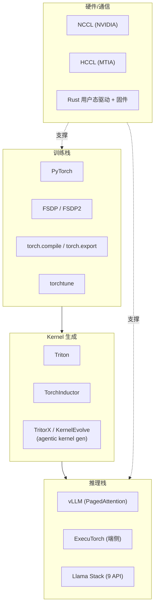
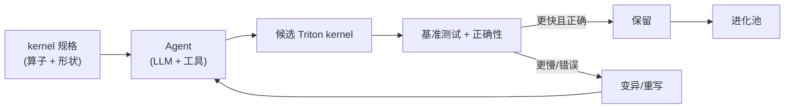

# 6. 源码与生态分析

Meta 与其他前沿实验室最大的区别在于：它的核心软件栈**几乎全部开源**。本章从"开源生态"与"MTIA 专用栈"两条线，分析 Meta 训练与服务基础设施的可对照实现。研究 Meta 的源码，本质是研究 PyTorch 生态——这也是为什么"Meta 基础设施"对整个行业有外部性价值。

## 6.1 开源生态全景



Meta 是 PyTorch 的主要贡献者，并衍生出围绕它的完整工具链。下表给出各组件的定位与可对照的开源仓库：

| 组件 | 作用 | 开源仓库 / 文档 |
|---|---|---|
| **PyTorch** | 训练/推理基础框架 | `pytorch/pytorch` |
| **FSDP / FSDP2** | 分片数据并行（参数/梯度/优化器状态分片） | `pytorch/FSDP`（torch.distributed） |
| **torch.compile / torch.export** | 图编译、IR 导出 | `pytorch/torch.compile`、TorchInductor |
| **Triton** | GPU kernel 语言与编译器 | `triton-lang/triton` |
| **torchtune** | PyTorch 原生微调库 | `pytorch/torchtune` |
| **ExecuTorch** | 移动/边缘推理 | `pytorch/executorch` |
| **vLLM** | 服务端推理（PagedAttention） | `vllm-project/vllm` |
| **Llama Stack** | 9 类标准化服务 API | `meta-llama/llama-stack` |
| **Llama 模型** | 开放权重 | `meta-llama/llama-models`、Hugging Face |

## 6.2 训练栈：FSDP 与 torch.compile

### FSDP / FSDP2

**FSDP（Fully Sharded Data Parallel）** 是 Meta 大规模训练的并行基石。核心思想：把模型参数、梯度、优化器状态**分片**到所有 rank，每个 rank 只持有 1/N；前向/反向时按需 AllGather 参数，用完即释放。

一个简化的 FSDP step（伪码，忠实于真实结构）：

```python
# FSDP 单层前向/反向的本质：分片参数按需聚合
def fsdp_forward(layer, x, shard):
    full = all_gather(shard)          # 按需聚合完整参数
    out = layer.fn(x, full)           # 前向计算
    del full                          # 释放，降显存
    return out

def fsdp_backward(layer, grad_out, shard, x):
    full = all_gather(shard)          # 反向也需要完整参数
    grad_x, grad_full = layer.vjp(x, full, grad_out)
    grad_shard = reduce_scatter(grad_full)  # 分片归约梯度
    return grad_x, grad_shard
```

每个 step 至少触发 **两次 AllGather**（前向 + 反向）——这正是 [第 4 章](04-training-and-inference) 强调"AllGather 调优决定 MFU"的原因。FSDP2 是重写版，用细粒度 per-parameter 分片与 DTensor，改善编译器兼容性与显存效率。

### torch.compile + TorchInductor

`torch.compile` 把 eager PyTorch 代码编译成优化图，后端 **TorchInductor** 把图 lowering 成 **Triton（GPU）/ C++（CPU）** kernel。这条链路在 MTIA 上同样适用——MTIA 的图编译器接收 Torch FX IR，复用 TorchInductor 的代码生成框架。

## 6.3 Kernel 生成：Triton 与 agentic AI

### Triton

Triton 让用户用 Python-like 语法写 GPU kernel，编译器自动处理 tile、共享内存、向量化。Meta 的训练与服务大量 kernel 用 Triton 实现，**torch.compile 默认后端就是生成 Triton kernel**。

### Agentic kernel 生成：TritorX / KernelEvolve

Meta 用 **agentic AI 自动生成与进化 kernel**（TritorX、KernelEvolve）——这是"用 AI 优化 AI 基础设施"的代表实践。流程大致是：



这与本手册 [Agent 篇](/05-agent/) 的"Agent + 工具 + 反思"模式同构：Agent 把"写高性能 kernel"这种需要专家经验的任务，变成可自动迭代搜索的工程问题。

## 6.4 推理栈：vLLM、ExecuTorch、Llama Stack

### vLLM（MTIA plugin）

vLLM 的 PagedAttention、continuous batching 是 Llama 服务端推理事实标准。MTIA 为 vLLM 提供 plugin backend：

- 用 MTIA 优化的 FlashAttention / fused-LayerNorm 替换默认 kernel。
- 作为 torch.compile backend。
- 支持 prefill-decode 分离（disaggregation）与 continuous batching。

这让 Llama 在 MTIA 与 NVIDIA 上的应用层体验一致——开放权重 + 标准推理栈 = 可移植部署。

### ExecuTorch（端侧）

ExecuTorch 把 Llama 部署到手机、边缘设备，是"开放权重下沉到端"的工具链。与本手册 [LLMOps](/04-llmops/) 的"端云协同"主题相关。

### Llama Stack

Llama Stack 把 9 类 API（Inference/Safety/Agentic/Memory/Eval/Telemetry/Post-training/Toolchain/RAG）标准化，与 [LLM Gateway](/04-llmops/llm-gateway/) 的"统一入口"、[Agent Runtime](/05-agent/agent-runtime/) 的"执行抽象"理念相通。

## 6.5 MTIA 专用软件栈

MTIA 虽是自研 ASIC，但坚持 **"PyTorch Native"**——不另起炉灶，而是把 MTIA 接入 PyTorch 生态：

| 层 | 实现 |
|---|---|
| 前端 | PyTorch（torch.compile / torch.export） |
| 图编译器 | Torch FX IR → TorchInductor |
| Kernel 编译器 | Triton / MLIR / LLVM |
| 通信库 | **HCCL（Hoot Collective Communications Library）** —— MTIA 版 NCCL |
| 用户态驱动 | **Rust** |
| 固件 | **bare-metal Rust** |
| kernel 生成 | TritorX / KernelEvolve |

用 Rust 写用户态驱动与 bare-metal 固件是值得注意的工程选择——Rust 的内存安全在"驱动/固件"这类易错层价值很高，能减少一类难以调试的故障（与 [第 5 章](05-core-modules) 的可靠性主题呼应）。

### HCCL：MTIA 的集合通信

HCCL 提供与 NCCL 接口对齐的集合通信（AllReduce、AllGather、ReduceScatter），让 FSDP 等 PyTorch 并行策略在 MTIA 上无修改运行。这是"开放 + 可移植"在通信层的具体兑现。

## 6.6 与 OpenAI / Anthropic 的源码可见性对照

| 维度 | OpenAI | Anthropic | Meta |
|---|---|---|---|
| 训练框架 | 闭源 | 闭源 | **PyTorch / FSDP（开源）** |
| Kernel 生成 | Triton（OpenAI 起源，现已独立开源） | 闭源 | **Triton + TritorX/KernelEvolve** |
| 推理引擎 | 闭源（API） | 闭源（API） | **vLLM + ExecuTorch + Llama Stack（开源）** |
| 自研硅软件栈 | 无自研硅 | Trainium（AWS 闭源 SDK） | **MTIA 全栈（编译器/通信/驱动部分开源）** |
| 模型权重 | 闭源 | 闭源 | **Llama 开放权重** |

研究 Meta 源码的独特价值：**它是唯一一个能让外部工程师"读代码、跑代码、改代码"的前沿实验室基础设施**。FSDP 的实现、torch.compile 的 lowering、Triton kernel 的写法、Llama Stack 的 API 设计，全部可对照学习——这也是本手册把 Meta 作为案例的核心理由之一。

## 小结

Meta 的源码与生态分析可以浓缩为一句话：**它把训练栈（PyTorch/FSDP/torch.compile）、kernel 生成（Triton/agentic AI）、推理栈（vLLM/ExecuTorch/Llama Stack）、自研硅软件（MTIA 编译器/HCCL/Rust）全部建立在开源与 PyTorch 原生之上**。这种"开放 + 可移植"的软件哲学，与 [第 2 章](02-core-ideas) 的五大支柱互相印证，也让 Meta 的基础设施工程成为整个行业可复用的公共资产。
