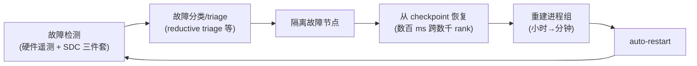
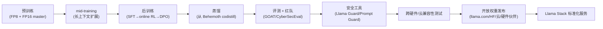

# 8. 企业生产实践

本章把前几章的架构与模块落到"真实生产环境怎么干"。Meta 的生产实践有两条格外突出的主线：**大规模训练可靠性工程**（这是 GenAI 时代最难、最独特的部分）与**开放权重的从训练到发布流水线**（这是 Meta 独有的工程链路）。此外还涉及双网络织物选型、异构硅治理、电力与选址等基础设施决策。

## 8.1 大规模训练可靠性工程

### 8.1.1 数字背后的工程

Meta 公开的关键可靠性数字：

| 指标 | 数值 | 含义 |
|---|---|---|
| Llama 3 有效训练时间 | **>95%** | 挂钟时间里 95% 在做持久前进的计算（含故障恢复开销后） |
| 16k GPU 算力 | **>400 TFLOPS/GPU** | 单 GPU 实际算力利用率 |
| 中断率下降 | **~50×** | 通过行业协作把训练中断率压低约 50 倍 |
| 硬件中断占比 | **>66%** | Llama 3 训练中断中，SRAM/HBM/processing grid/网络交换机故障 |
| 相比 Llama 2 效率 | **~3×** | 端到端训练效率提升 |
| SDC 率 | **~1/1000 设备** | 比宇宙射线软错误高 1000 倍 |

> 本手册 [Mini Demo](07-mini-demo) 的"有效训练时间"指标正是 >95% 的同口径计算。

### 8.1.2 可靠性即工程闭环

把 >95% 的有效训练时间拆开，是一套从故障到恢复的闭环：

每个环节都有专门的工程优化：

- **检测**：硬件遥测（RAS）+ SDC 三件套（Fleetscanner/Ripple/Hardware Sentinel）。
- **triage**：reductive triage（二分搜索隔离 NaN 源）、deterministic training、hyper-checkpointing。
- **恢复**：Tectonic Flash 吞吐支撑的数百毫秒级 checkpoint 存取。
- **重建**：PyTorch 进程组初始化从数小时降到数分钟（缓存 + 并行初始化）。
- **auto-restart**：把整个故障→恢复闭环自动化，减少人工介入。

### 8.1.3 SDC 专项治理

SDC 是同步训练最隐蔽的敌人——它不停顿任务，而是静默腐蚀。Meta 的治理分两层（[第 5 章](05-core-modules) 详述）：

**基础设施层（集群 triage）**：reductive triage、deterministic training、hyper-checkpointing——用集群级手段隔离与重放。

**栈层（与 workload 协同）**：gradient clipping、algorithmic fault tolerance、tri-variate computational training（shadow node）、parameter vulnerability factors（脆弱层映射到韧性硬件）、divergence detection（推理期神经元分布图）。

工程上最关键的洞察是 [Mini Demo](07-mini-demo) 验证的那条：**只要"验证先于 checkpoint"，SDC 就能在被焊死进 checkpoint 前被捕获**——这把"训练质量被静默破坏"的风险降到可接受水平。

## 8.2 双网络织物选型

Meta 同时建 RoCE 与 InfiniBand 两个 24k 集群，是深思熟虑的风险管理。生产视角的考量：

| 维度 | 选 RoCE 的理由 | 选 InfiniBand 的理由 |
|---|---|---|
| 供应链 | 多供应商以太网生态（Arista、Broadcom、OCP） | NVIDIA 全栈，集成度高 |
| 成本 | 开放生态竞争压价 | 单一供应商溢价 |
| 技术 | 已验证可做超大规模（Llama 3 在 RoCE 训练） | 成熟的 HPC 语义与拥塞控制 |
| 风险 | 以太网大规模 collective 调优更难 | 供应商锁定 |

**生产经验**：两者都能跑通大规模训练，前提是做好**拓扑感知调度 + NCCL 路由协同**。Meta 的选择是"两个都要"——用并行验证对冲技术与供应链风险。

## 8.3 异构硅治理

Meta 部署 NVIDIA（H100/Blackwell/GB300）、AMD MI300、自研 MTIA（300/400/450/500）多种硅。异构治理的关键：

- **统一软件栈**：所有硅都接 PyTorch（torch.compile/Triton），让 kernel 与并行策略可移植。
- **专用通信库**：NVIDIA 用 NCCL，MTIA 用 HCCL（接口对齐）。
- **负载匹配硅**：ranking/recommendation 用 MTIA（推理优化），LLM 训练用 H100/Blackwell，部分推理用 MI300。
- **供应链缓冲**：NVIDIA 产能受限时，AMD/MTIA 提供容量备份。

MTIA 的 cadence（~6 个月/代）与"同 chassis/rack/network drop-in 升级"让硬件迭代与集群运营解耦——这是异构治理的工程杠杆。

## 8.4 开放权重的从训练到发布流水线

这是 Meta 独有的工程链路。开放权重意味着模型要部署到**所有主流云、所有主流硬件、所有主流推理引擎**，倒逼出一套高度标准化的发布与兼容性测试流水线：

关键工程点：

- **兼容性测试**：权重要在 NVIDIA/AMD/Intel/Qualcomm/MTIA、AWS/Databricks/GCP/Azure/Hugging Face、vLLM/TGI/各推理引擎上都验证可跑——这是一套庞大的集成测试矩阵。
- **安全工具随权重开放**：Llama Guard/Prompt Guard/CyberSecEval/Code Shield 让部署方能自建安全策略。
- **Llama Stack 统一接口**：9 类 API 把"换底层实现不影响上层应用"标准化，降低生态碎片化。

Llama 4 的发布还引入 **GOAT（Generative Offensive Agent Testing）**——用多轮对抗 Agent 自动化红队，提升测试覆盖率、解放人工红队去攻新风险。

## 8.5 电力、冷却与选址：GW 级的约束

当集群到 1 GW 量级，数据中心设施成为主约束：

- **冷却**：Catalina 的 140 kW/pod 远超风冷能力，必须 AALC（风液混合）。液冷不是可选项，而是 GW 级的前提。
- **选址**：单一数据中心无法容纳 1 GW。**Prometheus（~1 GW）** 跨多栋建筑、防风雨帐篷、托管（colocation）场地；**Hyperion（最高 5 GW）** 进一步突破。
- **长距离训练**：跨建筑/园区的同步训练需要 Twine + MAST 管理长距离光纤互连下的带宽与延迟——这是地理分布式训练的工程前沿。
- **电力获取**：GW 级用电本身就是选址与电网协调难题，常需要与电力公司/政府长期规划。

## 8.6 成本与效率：把每 FLOPS 的成本打下来

Meta 的效率工程围绕"降低有效计算的边际成本"：

- **低精度**：FP8 训练（390–400+ TFLOPS/GPU）直接提升单卡吞吐。
- **MoE 推理**：Llama 4 Maverick 只激活 17B/400B → 推理 FLOPS 与 dense 17B 相当。
- **GQA/iRoPE**：降低 KV cache 与长上下文开销。
- **可靠性**：>95% 有效训练时间意味着"花在训练上的钱 95% 没白花"——可靠性本身就是成本优化。
- **自研硅**：MTIA 在 ranking/recommendation 推理上优化单位成本。

## 8.7 与 OpenAI / Anthropic 的生产实践对照

| 维度 | OpenAI | Anthropic | Meta |
|---|---|---|---|
| 可靠性工程 | （未公开） | （未公开） | **SDC 治理 + ~50x 中断下降（公开）** |
| 硬件策略 | Azure + NVIDIA | Trainium + GPU 异构采购 | **OCP 协同设计 + MTIA + 多供应商** |
| 发布形态 | 闭源 API | 闭源 API | **开放权重 + 跨硬件兼容矩阵** |
| 服务接口 | （闭源） | （闭源） | **Llama Stack（开放 9 API）** |
| 电力路线 | （未公开） | Project Rainier 5GW | **Prometheus 1GW → Hyperion 5GW** |

## 小结

Meta 的生产实践可以浓缩为：**用一套贯穿"检测→triage→恢复→重建→restart"的可靠性闭环，把同步训练的有效时间推到 >95%；用开放权重 + Llama Stack + 跨硬件兼容矩阵，把前沿模型变成可在任何地方部署的公共资产；用 AALC + 多栋建筑 + 长距离训练，把规模推到 GW 级**。这些实践既是 Meta 自身规模化的答案，也是开放给整个行业的可复用经验。
