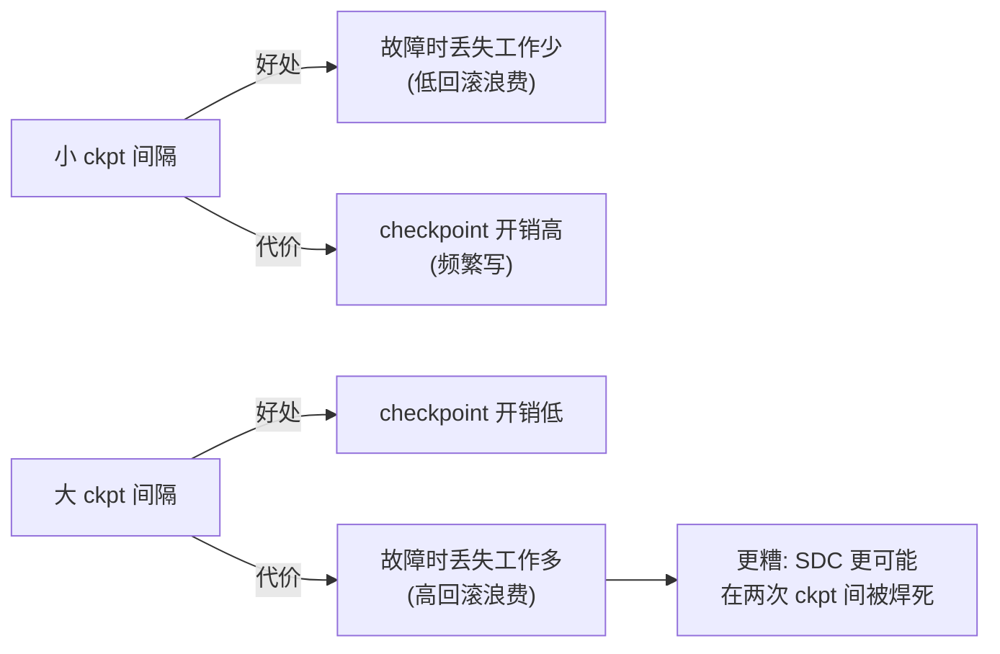

# 9. 最佳实践

本章把 Meta 基础设施工程提炼为可复用的设计原则、检查清单与 trade-off 决策。这些经验不仅适用于"造 Meta 规模的集群"，也适用于任何要在大规模上跑同步训练或开放模型部署的团队。

## 9.1 设计原则

### 原则 1：把可靠性当成一等设计目标，而不是事后补丁

同步训练把单点故障放大成全局停顿。**可靠性不是"上线后加监控"，而是架构的第一约束**：

- 从第一天就设计故障检测、checkpoint、auto-restart。
- 用"有效训练时间"作为北极星指标，而不是"GPU 数量"。
- 把 SDC 当成必然事件来设计（~1/1000 设备），而不是小概率异常。

### 原则 2：开放标准是规模化的杠杆

当你把硬件设计（OCP）、软件栈（PyTorch）、模型权重（Llama）、服务接口（Llama Stack）都开放，供应链与生态会围绕统一标准优化——**开放不是慈善，是降低边际成本的工程策略**。

### 原则 3：用协同设计对抗集成复杂度

大规模集群的瓶颈不在单台服务器，而在**整机柜/整集群的集成**（电源、散热、布线、远程管理）。与芯片厂商协同设计整机柜（Grand Teton/Catalina），比优化单台服务器收益更大。

### 原则 4：双轨验证对冲风险

对关键依赖（网络织物、芯片供应商）保持**两条并行的技术路线**，用并行验证对冲供应链与技术风险。Meta 的 RoCE + InfiniBand 是范例。

### 原则 5：统一软件栈换可移植性

所有硬件接同一个软件栈（PyTorch + torch.compile + Triton），让 kernel 与并行策略可跨硬件复用。这是"自研硅（MTIA）不另起炉灶"的工程前提。

## 9.2 可靠性工程检查清单

| # | 检查项 | 说明 |
|---|---|---|
| 1 | 故障分类体系 | 区分 static / transient / silent，分别治理 |
| 2 | SDC 三层检测 | 维护期扫描（Fleetscanner 类）+ 同机共存检测（Ripple 类）+ 内核态分析（Hardware Sentinel 类） |
| 3 | 验证先于 checkpoint | `validation_interval ≤ ckpt_interval`，SDC 在焊死前被捕获（见 [Mini Demo](07-mini-demo)） |
| 4 | checkpoint 延迟 | 跨数千 rank 在秒级（理想数百 ms）内存取 |
| 5 | 进程组初始化 | 从冷启动到可用分钟级，不是小时级 |
| 6 | auto-restart | 故障→恢复闭环自动化，减少人工 |
| 7 | 可观测性 | desync debug + collective flight recorder，能回放定位瓶颈 rank |
| 8 | 训练 SDC 治理 | gradient clipping、deterministic training、hyper-checkpointing、reductive triage |
| 9 | 推理 SDC 治理 | divergence detection（神经元分布图）+ 故障节点隔离 |
| 10 | factory-to-fleet | 把可靠性贯穿硅全生命周期（设计→验证→部署→运营） |

## 9.3 Checkpoint 间隔的 trade-off

[Mini Demo](07-mini-demo) 量化的核心 trade-off：



**最佳实践**：ckpt 间隔应与"平均故障间隔（MTBF）"匹配——间隔远小于 MTBF 时回滚浪费低；同时保证 `validation_interval ≤ ckpt_interval` 让 SDC 可被捕获。在 Meta 规模下，Tectonic 的 Flash 吞吐让"小间隔 + 低开销"同时成立，这是 >95% 有效训练时间的物质基础。

## 9.4 网络织物选型决策树

```text
要不要做超大规模同步训练？
├─ 否（中小规模推理/训练）→ 以太网/RoCE 足矣，性价比高
└─ 是 → 是否担心单一供应商锁定？
    ├─ 是 → 双织物并行（RoCE + InfiniBand）对冲
    │        前提：投入拓扑感知调度 + NCCL 协同优化
    └─ 否 → InfiniBand（成熟、集成度高）
             但要做好"被供应商卡产能/价格"的对冲预案
```

无论选哪种，**拓扑感知调度 + collective 路由协同**是大规模训练的必备工程——否则 AllGather 利用率会在 10%–90% 剧烈波动。

## 9.5 异构硅治理原则

- **统一抽象**：所有硅接 PyTorch，通信库接口对齐（NCCL/HCCL）。
- **负载匹配**：推理优化硅（MTIA）跑 ranking/recommendation，通用 GPU 跑 LLM 训练。
- **drop-in 升级**：硬件迭代与集群运营解耦（同 chassis/rack/network）。
- **供应链缓冲**：不把全部容量押单一供应商。
- **可靠性数据驱动**：用 factory-to-fleet 的故障数据反馈下一代硅设计。

## 9.6 开放权重发布的工程清单

| # | 检查项 |
|---|---|
| 1 | 跨硬件兼容矩阵（NVIDIA/AMD/Intel/Qualcomm/自研硅） |
| 2 | 跨云部署验证（AWS/GCP/Azure/Databricks/HF） |
| 3 | 跨推理引擎验证（vLLM/TGI/各框架） |
| 4 | 安全工具随权重开放（Llama Guard/Prompt Guard/CyberSecEval） |
| 5 | 标准化服务接口（Llama Stack 9 API） |
| 6 | 评测 + 红队（含 GOAT 类自动化红队） |
| 7 | 偏见与对齐测试（如 Llama 4 的政治偏见降低） |
| 8 | 文档与 Responsible Use Guide |

## 9.7 反模式（别这么干）

- ❌ **只押一种网络织物/一种芯片** → 供应链或技术路线出问题时无路可退。
- ❌ **checkpoint 间隔拍脑袋设大** → 故障时丢失大量工作，SDC 还会焊死。
- ❌ **SDC 当小概率异常** → 在 1/1000 设备的规模下必然发生，会静默毁掉训练。
- ❌ **自研硅另起软件炉灶** → 失去 PyTorch 生态红利，kernel/并行策略不可移植。
- ❌ **用"GPU 数量"当成功指标** → 真正的指标是"有效训练时间"与"单位 FLOPS 成本"。
- ❌ **开放权重但不提供安全工具与服务接口** → 生态碎片化，部署方各自踩坑。
- ❌ **可靠性只靠软件兜底** → 同步训练下"重试到另一台"不成立，必须从硅生命周期（factory-to-fleet）就设计可靠性。

## 9.8 与本手册其他主题的最佳实践联动

| 主题 | 借鉴 Meta 的什么 |
|---|---|
| [AI SRE](/07-ai-sre/) | 同步训练的故障闭环、SDC 治理、有效训练时间 SLO |
| [LLMOps / vLLM](/04-llmops/vllm/) | PyTorch 原生推理栈、MTIA vLLM backend、Llama Stack 接口 |
| [LLM Gateway](/04-llmops/llm-gateway/) | Llama Stack 统一入口理念 |
| [安全](/08-security/) | 开放安全工具（Llama Guard/Prompt Guard/CyberSecEval）、GOAT 红队 |
| [Agent Runtime](/05-agent/agent-runtime/) | Llama Stack Agent API |

## 小结

Meta 的最佳实践可以浓缩为一句话：**把可靠性当一等设计、把开放当规模杠杆、用协同设计对抗集成复杂度、用双轨验证对冲风险、用统一软件栈换可移植性**。这些原则互相强化，构成了 Meta 在 GenAI 时代"既能造得出、又能用得起、还能开放出去"的工程闭环——也是任何想在大规模上跑同步训练或开放模型部署的团队可复用的蓝图。
