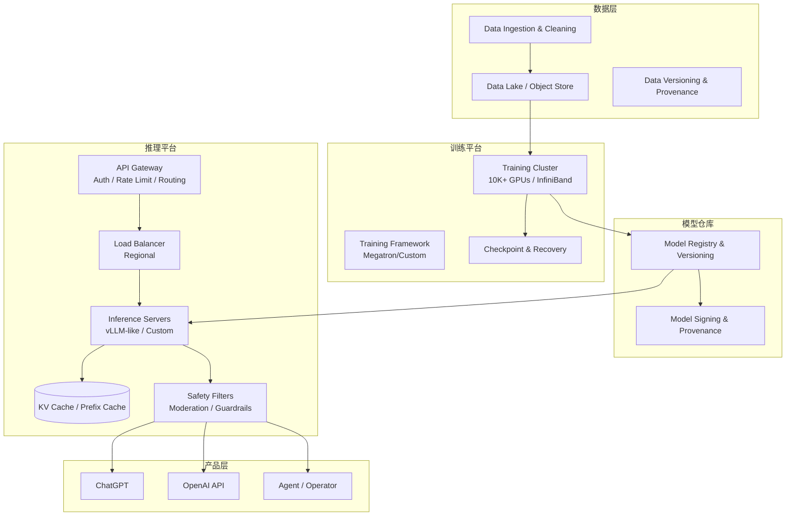

# 架构设计

OpenAI 的基础设施可以抽象为两大主线：**训练平台**负责生产模型，**推理平台**负责把模型变成在线服务。两者共享数据与模型仓库，但对稳定性、延迟、成本的要求截然不同。

## 总体架构

## 训练平台架构

### 计算层

- **GPU 集群**：从 V100 → A100 → H100/H200，单集群规模达到数万台。
- **网络**：NVIDIA Quantum-2 InfiniBand，400 Gb/s per GPU，配合 NVSwitch/NVLink 实现高带宽 all-reduce。
- **存储**：高吞吐并行文件系统或对象存储，支持大规模 checkpoint 读写。

### 软件层

- **分布式训练框架**：基于 PyTorch 的 Megatron-LM、FSDP、ZeRO、3D 并行（数据/张量/流水线并行）。
- **MoE 路由**：GPT-4 等模型采用 Mixture-of-Experts，需要专家并行与 all-to-all 通信优化。
- **Checkpointing**：高频 checkpoint（如每 5–15 分钟）以应对 GPU/网络故障；Project Forge 提供透明 checkpointing 与弹性。
- **调度**：Kubernetes 或自研调度器管理长周期训练任务与抢占策略。

### 可靠性

- **故障是常态**：数万 GPU 集群中，每天都会有 GPU、网卡、光模块故障。
- **快速恢复**：checkpoint + 自动重启，减少单点故障导致的训练停滞。
- **网络拓扑优化**：机架内、机架间、pod 间的带宽与延迟差异影响并行策略。

## 推理平台架构

### 接入层

- **API Gateway**：认证、限流、多租户隔离、模型路由、版本管理。
- **Global Load Balancing**：按用户地理位置与模型可用性路由到最近区域。

### 推理引擎层

- **Continuous Batching / In-flight Batching**：提高 GPU 利用率，降低平均延迟。
- **KV Cache 管理**：PagedAttention 或类似技术减少内存碎片，支持更长上下文。
- **Prefix Caching**：对重复系统提示或前缀复用 KV cache。
- **Speculative Decoding**：用小模型草稿 + 大模型验证加速生成。

### 安全与过滤层

- **Moderation API**：独立分类模型检测有害内容。
- **System-level Guardrails**：对输入/输出做过滤、拒绝训练、滥用检测。
- **Audit & Observability**：记录每次调用用于计费、安全审查与模型改进。

## 数据与控制面

| 平面 | 职责 | 典型系统 |
|---|---|---|
| 数据面 | 实际训练/推理流量、模型权重、KV cache | GPU、InfiniBand、推理服务器 |
| 控制面 | 任务调度、模型版本、权限、策略、实验追踪 | Kubernetes、Model Registry、IdP、Policy Engine |

## 与云厂商的关系

OpenAI 的训练集群主要运行在 Microsoft Azure 的专用基础设施上；推理与 API 也大量依赖 Azure 的全球网络与数据中心。Azure OpenAI Service 则是 Microsoft 基于同一套模型能力构建的企业服务。

## 小结

OpenAI 的架构不是单一系统，而是**数据 → 训练 → 模型仓库 → 推理 → 产品**的完整流水线。下一章将拆解这条流水线的关键阶段。
