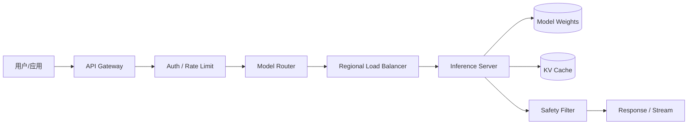

# 训练与推理流水线

OpenAI 把模型从“数据”变成“线上服务”的过程，可以分为两条紧密耦合的流水线：训练流水线和推理流水线。

## 训练流水线

### 1. 数据采集与清洗

- **来源**：Common Crawl、书籍、代码、维基百科、授权数据集、合成数据。
- **清洗**：去重、低质量过滤、PII 处理、版权风险过滤、语言识别。
- **规模**：最终用于训练的 token 可达数万亿。

### 2. Tokenization

- 使用 BPE（Byte-Pair Encoding）或其变体。
- 词汇表大小通常在 50k–200k 之间，直接影响压缩率与推理效率。

### 3. 分布式训练

- **数据并行**：每个 GPU 处理不同数据批次，梯度 all-reduce 同步。
- **张量并行**：单层计算拆分到多个 GPU。
- **流水线并行**：不同层分配到不同 GPU。
- **专家并行（MoE）**：不同 expert 分配到不同 GPU，需要 all-to-all 通信。

### 4. Checkpoint 与容错

- 高频 checkpoint 以应对硬件故障。
- 存储吞吐是关键：大模型 checkpoint 可达 TB 级，写入速度影响训练效率。
- Project Forge 等机制支持透明 checkpoint 与快速恢复。

### 5. 评估与对齐

- **基础评估**：perplexity、下游任务 benchmark。
- **安全评估**：Preparedness Framework 四类风险评测。
- **对齐训练**：RLHF、DPO、Constitutional AI。
- **红队测试**：内部 + 外部红队，多语言、多模态。

### 6. 模型发布

- 生成 System Card、Model Card。
- 分阶段向 API、ChatGPT、企业客户开放。
- 版本化命名（`gpt-4-1106-preview`、`gpt-4o-2024-08-06`）。

## 推理流水线

### 1. 请求接入

- 认证：API Key、Organization ID、Project ID。
- 限流：按 tier、按模型、按并发、按 token budget。
- 路由：根据模型名称、区域、容量选择推理集群。

### 2. 预处理

- 解析请求体（messages、functions、tools、stream、response_format）。
- 应用 tokenizer，计算输入 token 数。
- 检查上下文长度与内容安全。

### 3. 推理执行

- 加载模型权重到 GPU。
- 分配 KV cache。
- 自回归生成 token，直到遇到 stop token 或达到 max_tokens。
- 对 streaming 请求，逐 token 推送 SSE。

### 4. 后处理与安全

- 输出 moderation 检测。
- 格式化响应（JSON mode、function call）。
- 记录日志、计费、审计。

## 训练与推理的协同

| 方面 | 训练 | 推理 |
|---|---|---|
| 目标 | 高吞吐、高利用率、容错 | 低延迟、高可用、低成本 |
| 主要资源 | GPU 计算 + 网络 + 存储 | GPU 计算 + KV cache + 网络 |
| 并行策略 | 数据/张量/流水线/专家并行 | Continuous batching、speculative decoding |
| 故障影响 | 损失训练时间（昂贵） | 影响用户体验/收入 |
| 优化重点 | checkpoint、all-reduce、MoE 通信 | TTFT、ITL、缓存、路由 |

## 小结

OpenAI 的训练流水线强调“规模化与容错”，推理流水线强调“低延迟与成本”。两条流水线通过模型仓库与版本管理紧密衔接。下一章拆解支撑这两条流水线的核心模块。
